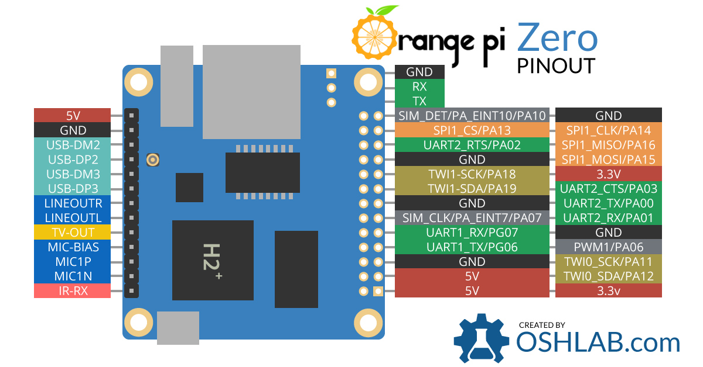

# Управление GPIO в armbian

Для настройки и проверки работы с GPIO нужно установить gpiod:

```
sudo apt-get install gpiod
```

Попытка изменения состояния ног приводит к ошибке:

````
gpioset: error setting the GPIO line values: Permission denied
````

Это связано с правами на устройства:

```
~$ ls -l /dev/gpiochip*
crw------- 1 root root 254, 0 Sep 16 11:42 /dev/gpiochip0
crw------- 1 root root 254, 1 Sep 16 11:42 /dev/gpiochip1
```

Добавляем группу gpio и добавляем в нее пользователя:

```
~$ sudo groupadd gpio
~$ sudo usermod -a -G gpio sergey
```

Добавляем в udev правило для установки группы и прав доступа при загруке:

```
 echo "SUBSYSTEM==\"gpio\", KERNEL==\"gpiochip[0-4]\", GROUP=\"gpio\", MODE=\"0660\"" |sudo tee -a  /etc/udev/rules.d/97-gpio.rules
```

Применяем новые правила и проверяем права доступа:

```
~$ sudo udevadm control --reload-rules
~$ sudo udevadm trigger
~$ ls -l /dev/gpiochip*
crw-rw---- 1 root gpio 254, 0 Sep 16 12:05 /dev/gpiochip0
crw-rw---- 1 root gpio 254, 1 Sep 16 12:05 /dev/gpiochip1
```
Для того, чтобы к текущему пользователю применилась добавленная группа gpio нужно выйти из системы и залогиниться снова. После этого можно проверить работу. gpiodetect покажет какие есть gpiochip и сколько на них линий, gpioinfo покажет список всех линий и какие функции на них активны.

Для проверки я использовал плату Orange Pi Zero.



На схеме платы пины как правило обозначены именем PXY, где X - буква, а Y цифра. В командах управления состоянием gpio используется номер линии. Номер линии из имени пина получается по формуле: (позиция буквы в алфавите - 1) x32 + номер пина. Например PH18 будет (8 - 1) x 32 + 18 = 224 + 18 = 242. Либо можно посмотреть командами:

```
~$ sudo ls /sys/kernel/debug/pinctrl
1c20800.pinctrl  1f02c00.pinctrl  pinctrl-devices  pinctrl-handles  pinctrl-maps

~$ sudo cat /sys/kernel/debug/pinctrl/1c20800.pinctrl/pinmux-pins
Pinmux settings per pin
Format: pin (name): mux_owner gpio_owner hog?
pin 0 (PA0): (MUX UNCLAIMED) (GPIO UNCLAIMED)
pin 1 (PA1): (MUX UNCLAIMED) (GPIO UNCLAIMED)
pin 2 (PA2): (MUX UNCLAIMED) (GPIO UNCLAIMED)
pin 3 (PA3): (MUX UNCLAIMED) (GPIO UNCLAIMED)
pin 4 (PA4): 1c28000.serial (GPIO UNCLAIMED) function uart0 group PA4
pin 5 (PA5): 1c28000.serial (GPIO UNCLAIMED) function uart0 group PA5
pin 6 (PA6): (MUX UNCLAIMED) (GPIO UNCLAIMED)
pin 7 (PA7): (MUX UNCLAIMED) (GPIO UNCLAIMED)
pin 8 (PA8): (MUX UNCLAIMED) (GPIO UNCLAIMED)
pin 9 (PA9): (MUX UNCLAIMED) (GPIO UNCLAIMED)
pin 10 (PA10): (MUX UNCLAIMED) (GPIO UNCLAIMED)
pin 11 (PA11): (MUX UNCLAIMED) (GPIO UNCLAIMED)
pin 12 (PA12): (MUX UNCLAIMED) (GPIO UNCLAIMED)
pin 13 (PA13): (MUX UNCLAIMED) (GPIO UNCLAIMED)
pin 14 (PA14): (MUX UNCLAIMED) (GPIO UNCLAIMED)
pin 15 (PA15): (MUX UNCLAIMED) (GPIO UNCLAIMED)
pin 16 (PA16): (MUX UNCLAIMED) (GPIO UNCLAIMED)
pin 17 (PA17): (MUX UNCLAIMED) 1c20800.pinctrl:17
pin 18 (PA18): (MUX UNCLAIMED) (GPIO UNCLAIMED)
pin 19 (PA19): (MUX UNCLAIMED) (GPIO UNCLAIMED)
pin 20 (PA20): (MUX UNCLAIMED) 1c20800.pinctrl:20
pin 21 (PA21): (MUX UNCLAIMED) (GPIO UNCLAIMED)
pin 64 (PC0): (MUX UNCLAIMED) (GPIO UNCLAIMED)
pin 65 (PC1): (MUX UNCLAIMED) (GPIO UNCLAIMED)
pin 66 (PC2): (MUX UNCLAIMED) (GPIO UNCLAIMED)
pin 67 (PC3): (MUX UNCLAIMED) (GPIO UNCLAIMED)
pin 68 (PC4): (MUX UNCLAIMED) (GPIO UNCLAIMED)
pin 69 (PC5): (MUX UNCLAIMED) (GPIO UNCLAIMED)
pin 70 (PC6): (MUX UNCLAIMED) (GPIO UNCLAIMED)
pin 71 (PC7): (MUX UNCLAIMED) (GPIO UNCLAIMED)
pin 72 (PC8): (MUX UNCLAIMED) (GPIO UNCLAIMED)
pin 73 (PC9): (MUX UNCLAIMED) (GPIO UNCLAIMED)
pin 74 (PC10): (MUX UNCLAIMED) (GPIO UNCLAIMED)
pin 75 (PC11): (MUX UNCLAIMED) (GPIO UNCLAIMED)
pin 76 (PC12): (MUX UNCLAIMED) (GPIO UNCLAIMED)
pin 77 (PC13): (MUX UNCLAIMED) (GPIO UNCLAIMED)
pin 78 (PC14): (MUX UNCLAIMED) (GPIO UNCLAIMED)
pin 79 (PC15): (MUX UNCLAIMED) (GPIO UNCLAIMED)
pin 80 (PC16): (MUX UNCLAIMED) (GPIO UNCLAIMED)
pin 96 (PD0): (MUX UNCLAIMED) (GPIO UNCLAIMED)
pin 97 (PD1): (MUX UNCLAIMED) (GPIO UNCLAIMED)
pin 98 (PD2): (MUX UNCLAIMED) (GPIO UNCLAIMED)
pin 99 (PD3): (MUX UNCLAIMED) (GPIO UNCLAIMED)
pin 100 (PD4): (MUX UNCLAIMED) (GPIO UNCLAIMED)
pin 101 (PD5): (MUX UNCLAIMED) (GPIO UNCLAIMED)
pin 102 (PD6): (MUX UNCLAIMED) (GPIO UNCLAIMED)
pin 103 (PD7): (MUX UNCLAIMED) (GPIO UNCLAIMED)
pin 104 (PD8): (MUX UNCLAIMED) (GPIO UNCLAIMED)
pin 105 (PD9): (MUX UNCLAIMED) (GPIO UNCLAIMED)
pin 106 (PD10): (MUX UNCLAIMED) (GPIO UNCLAIMED)
pin 107 (PD11): (MUX UNCLAIMED) (GPIO UNCLAIMED)
pin 108 (PD12): (MUX UNCLAIMED) (GPIO UNCLAIMED)
pin 109 (PD13): (MUX UNCLAIMED) (GPIO UNCLAIMED)
pin 110 (PD14): (MUX UNCLAIMED) (GPIO UNCLAIMED)
pin 111 (PD15): (MUX UNCLAIMED) (GPIO UNCLAIMED)
pin 112 (PD16): (MUX UNCLAIMED) (GPIO UNCLAIMED)
pin 113 (PD17): (MUX UNCLAIMED) (GPIO UNCLAIMED)
pin 128 (PE0): (MUX UNCLAIMED) (GPIO UNCLAIMED)
pin 129 (PE1): (MUX UNCLAIMED) (GPIO UNCLAIMED)
pin 130 (PE2): (MUX UNCLAIMED) (GPIO UNCLAIMED)
pin 131 (PE3): (MUX UNCLAIMED) (GPIO UNCLAIMED)
pin 132 (PE4): (MUX UNCLAIMED) (GPIO UNCLAIMED)
pin 133 (PE5): (MUX UNCLAIMED) (GPIO UNCLAIMED)
pin 134 (PE6): (MUX UNCLAIMED) (GPIO UNCLAIMED)
pin 135 (PE7): (MUX UNCLAIMED) (GPIO UNCLAIMED)
pin 136 (PE8): (MUX UNCLAIMED) (GPIO UNCLAIMED)
pin 137 (PE9): (MUX UNCLAIMED) (GPIO UNCLAIMED)
pin 138 (PE10): (MUX UNCLAIMED) (GPIO UNCLAIMED)
pin 139 (PE11): (MUX UNCLAIMED) (GPIO UNCLAIMED)
pin 140 (PE12): (MUX UNCLAIMED) (GPIO UNCLAIMED)
pin 141 (PE13): (MUX UNCLAIMED) (GPIO UNCLAIMED)
pin 142 (PE14): (MUX UNCLAIMED) (GPIO UNCLAIMED)
pin 143 (PE15): (MUX UNCLAIMED) (GPIO UNCLAIMED)
pin 160 (PF0): 1c0f000.mmc (GPIO UNCLAIMED) function mmc0 group PF0
pin 161 (PF1): 1c0f000.mmc (GPIO UNCLAIMED) function mmc0 group PF1
pin 162 (PF2): 1c0f000.mmc (GPIO UNCLAIMED) function mmc0 group PF2
pin 163 (PF3): 1c0f000.mmc (GPIO UNCLAIMED) function mmc0 group PF3
pin 164 (PF4): 1c0f000.mmc (GPIO UNCLAIMED) function mmc0 group PF4
pin 165 (PF5): 1c0f000.mmc (GPIO UNCLAIMED) function mmc0 group PF5
pin 166 (PF6): (MUX UNCLAIMED) 1c20800.pinctrl:166
pin 192 (PG0): 1c10000.mmc (GPIO UNCLAIMED) function mmc1 group PG0
pin 193 (PG1): 1c10000.mmc (GPIO UNCLAIMED) function mmc1 group PG1
pin 194 (PG2): 1c10000.mmc (GPIO UNCLAIMED) function mmc1 group PG2
pin 195 (PG3): 1c10000.mmc (GPIO UNCLAIMED) function mmc1 group PG3
pin 196 (PG4): 1c10000.mmc (GPIO UNCLAIMED) function mmc1 group PG4
pin 197 (PG5): 1c10000.mmc (GPIO UNCLAIMED) function mmc1 group PG5
pin 198 (PG6): (MUX UNCLAIMED) (GPIO UNCLAIMED)
pin 199 (PG7): (MUX UNCLAIMED) (GPIO UNCLAIMED)
pin 200 (PG8): (MUX UNCLAIMED) (GPIO UNCLAIMED)
pin 201 (PG9): (MUX UNCLAIMED) (GPIO UNCLAIMED)
pin 202 (PG10): (MUX UNCLAIMED) (GPIO UNCLAIMED)
pin 203 (PG11): (MUX UNCLAIMED) (GPIO UNCLAIMED)
pin 204 (PG12): (MUX UNCLAIMED) 1c20800.pinctrl:204
pin 205 (PG13): (MUX UNCLAIMED) (GPIO UNCLAIMED)

~$ sudo cat /sys/kernel/debug/pinctrl/1f02c00.pinctrl/pinmux-pins
Pinmux settings per pin
Format: pin (name): mux_owner gpio_owner hog?
pin 352 (PL0): (MUX UNCLAIMED) (GPIO UNCLAIMED)
pin 353 (PL1): (MUX UNCLAIMED) (GPIO UNCLAIMED)
pin 354 (PL2): (MUX UNCLAIMED) (GPIO UNCLAIMED)
pin 355 (PL3): (MUX UNCLAIMED) (GPIO UNCLAIMED)
pin 356 (PL4): (MUX UNCLAIMED) (GPIO UNCLAIMED)
pin 357 (PL5): (MUX UNCLAIMED) (GPIO UNCLAIMED)
pin 358 (PL6): (MUX UNCLAIMED) 1f02c00.pinctrl:358
pin 359 (PL7): (MUX UNCLAIMED) 1f02c00.pinctrl:359
pin 360 (PL8): (MUX UNCLAIMED) (GPIO UNCLAIMED)
pin 361 (PL9): (MUX UNCLAIMED) (GPIO UNCLAIMED)
pin 362 (PL10): (MUX UNCLAIMED) 1f02c00.pinctrl:362
pin 363 (PL11): (MUX UNCLAIMED) (GPIO UNCLAIMED)

~$ gpiodetect
gpiochip0 [1c20800.pinctrl] (224 lines)
gpiochip1 [1f02c00.pinctrl] (32 lines)
sergey@orangepizero:~$ 
```

В данном случае можно посмотреть на каком gpiochip находится нужный пин.

Для управления можно воспользоваться командой gpioset. Например для управления ногой PA18:

```
~$ gpioset gpiochip0 18=0
~$ gpioset gpiochip0 18=1
```
