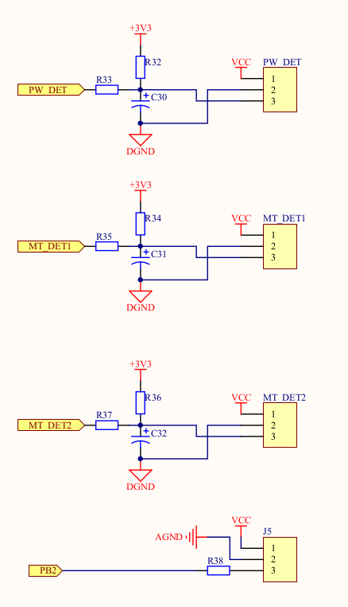
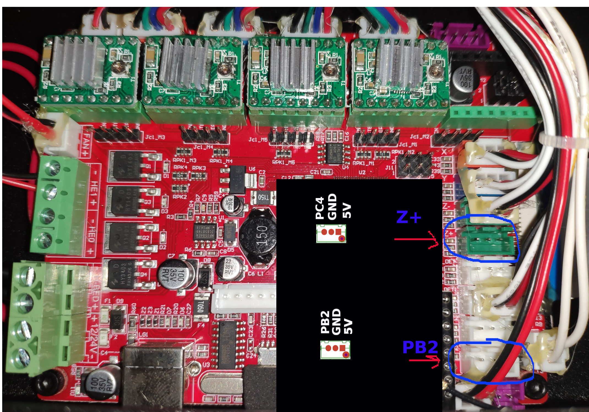
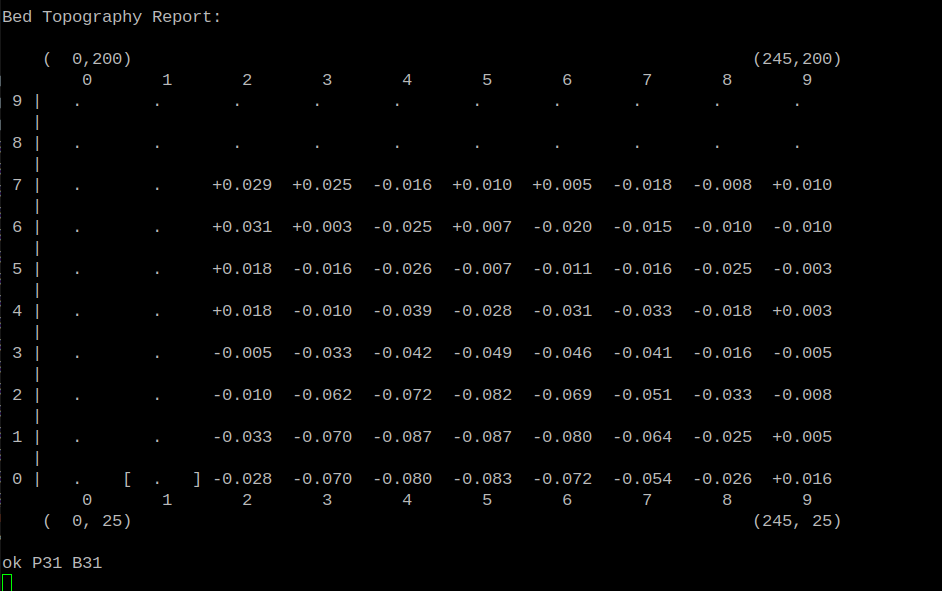
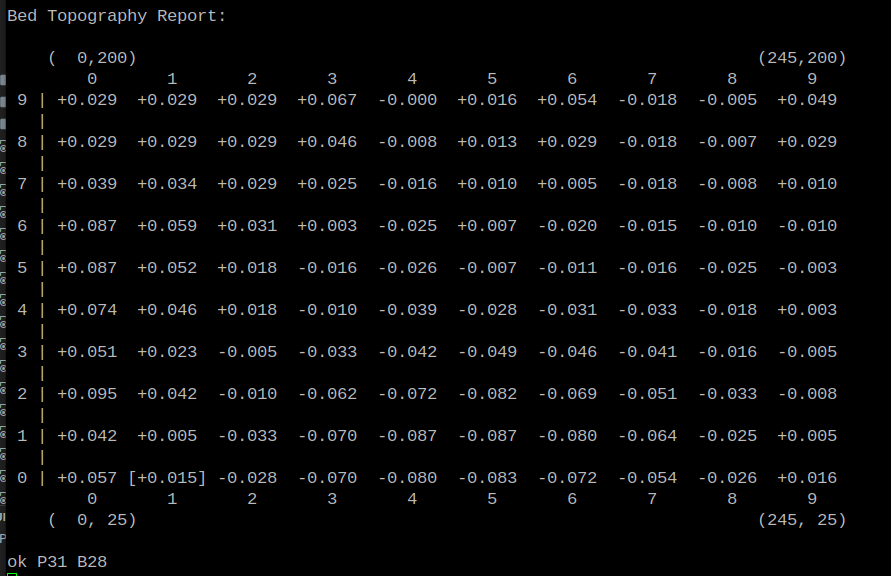
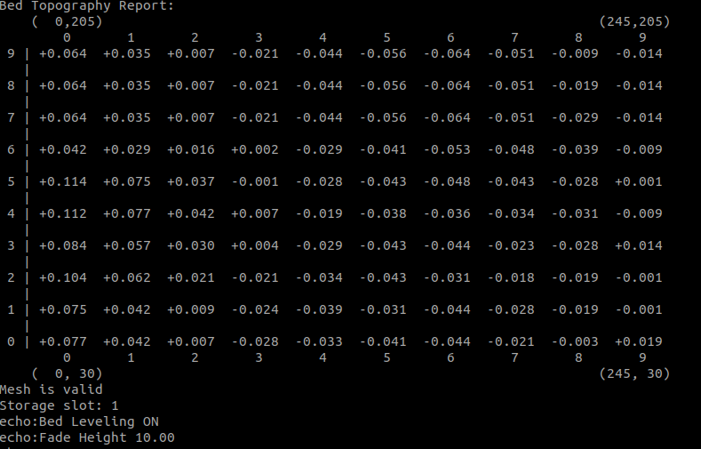

# Подключение датчика BLTouch к robin nano v1.1

Датчик BLtouch используется для построения карты высот стола. Общую информацию о работе и подключении можно посмотреть в видео:

* Дмитрий Соркин, [BLTouch. Стоит ли покупать? Установка, прошивка](https://www.youtube.com/watch?v=oJgKQKbN8nE)
* Бессистемный техноблог [Краткий рассказ о подключении датчика уровня стола BLTouch или его китайского аналога 3DTouch к плате MKS Robin Nano](https://www.youtube.com/watch?v=39TEYQN8iQ4)
* Sergey Irbis [Сравнение BLTouch и 3DTouch, тесты с кривым столом.](https://www.youtube.com/watch?v=x8OQZP-a3kc)

## Краткое содержание

* Подключение к плате MKS Robin Nano v1.*
* Настройка Marlin
* Построение сетки стола (AUTO_BED_LEVELING_UBL), настройка слайсера для быстрой коррекции перед печатью

## Датчик

[BLTouch](https://aliexpress.ru/item/32832887426.html) от Trianglelab. В комплекте с датчиком идут провода, но их длины не хватает для подключения к плате на FB4S. Для удлинения проводов можно использовать еще один комплект [удлинителя](https://aliexpress.ru/item/32842916585.html)

Для надежного подключения к плате можно использовать JST XH 2.54 3 Pin коннектор.

## Установка датчика

Для установки датчика на [универсальную голову для FB4S](https://www.thingiverse.com/thing:4394165) нужны [небольшие изменения](https://www.thingiverse.com/thing:4568900)

Для установки на другую голову, необходимо сделать кронштейн для датчика. Основные требования:

* В убранном состоянии щуп должен быть выше сопла
* В выдвинутом состоянии щуп должен быть ниже сопла
* Положение щупа, в котором срабатывает концевик, должно быть ниже сопла

## Принцип работы датчика

У датчика есть управляемый щуп, который он может выдвигать и задвигать по команде МК. Так же он может с высокой точностью и повторяемостью определять прохождение щупом "точки детекции". Когда стол толкает вытянутый щуп, в определенный момент он достигает "точку срабатывания" и датчик фиксирует именно это. Он не замеряет высоту от стола или насколько вытянут щуп. Он лишь сообщает МК, что щуп достиг "точки срабатывания", но делает это с погрешностью в тысячные доли миллиметра. МК, знает высоту по Z и по точке, где сработал датчик, определяет деформацию стола в этом месте.

В данном примере используется метод **Unified Bed Leveling**, который сочетает приемущества остальных способов, позволяет строить, редактировать и сохранять секту.

## Подключение

У датчика 5 проводов, которые можно разделить на две группы: управление щупом (серва) и концевик. Обычно провода обозначаются цветом.

Управление щупом:

* Коричневый - GND
* Красный - 5V
* Оранжевый - сигнал управления

Концевик:

* Черный - GND
* Белый - сигнал

Для более прогнозируемой и понятной работы Bltouch парковку оси Z следует сделать по датчику, а не по концевику. В данном случае, чтобы не вносить лишних изменений и оставить возможность отключить Bltouch только прошивкой, не изменяя подключения проводов, датчик подключен в разъем ZMax (пин PC4).

Управление выдвиганием щупа подключено в разъем PB2 (обозначен на плате).

Выбор ног для подключения может быть произвольным, однако надо учитывать, что на плате Robin Nano разъемы ZMin, Zmax, PWR-DET, MT1-DET, MT2-DET выполненый как вход. Выражается это в схемотехнике на плате:



Резисторы R32 - R37 номиналом 10К. Это позволяет подключать к этим разъемам устройства с уровнем в 5V. В том числе и BLTouch.

Разъем PB2 выполнен как выход, с токоограничивающим резистором R38 номинало 100 Ом.

На плате разъемы расположены следующим образом:



## Настройка Marlin

Настройки приведены для сборки [под FB4S](https://github.com/Sergey1560/Marlin_FB4S).

Основные настройки:

Marlin/src/pins/stm32f1/pins_MKS_ROBIN_NANO.h

```
#define SERVO0_PIN                          PB2
#define BL_TOUCH_Z_PIN                      PC4
```

Файл Marlin/Configuration.h, секция "Z Probe Options".

Поскольку используется парковка по BLtouch, а не по концевику, то нужно включить:

```
// Force the use of the probe for Z-axis homing
#define USE_PROBE_FOR_Z_HOMING
```

Нога щупа BLtouch:

```
#define Z_MIN_PROBE_PIN BL_TOUCH_Z_PIN
```

Отключить ручной режим, включить BLTouch

```
//#define PROBE_MANUALLY
#define BLTOUCH
```

Смещение сопла относительно датчика (зависит от физического положения датчика):

```
#define NOZZLE_TO_PROBE_OFFSET { 37, -20, 0 }
```

Измерять 3 раза и выпадающее значение отбрасывать:

```
#define MULTIPLE_PROBING 3
#define EXTRA_PROBING    1
```

Предел для установки Z Offset в мм:

```
#define Z_PROBE_OFFSET_RANGE_MIN -3
#define Z_PROBE_OFFSET_RANGE_MAX 3
```

Включение функции теста точности датчика:

```
#define Z_MIN_PROBE_REPEATABILITY_TEST
```

Задать способ построения сетки:

```
#define AUTO_BED_LEVELING_UBL
```

Включить Z_SAFE_HOMING и задать точку для парковки:

```
#define Z_SAFE_HOMING
#if ENABLED(Z_SAFE_HOMING)
  #define Z_SAFE_HOMING_X_POINT (37)    // X point for Z homing when homing all axes (G28).
  #define Z_SAFE_HOMING_Y_POINT (5)    // Y point for Z homing when homing all axes (G28).
#endif
```

Для Z_SAFE_HOMING_X_POINT и Z_SAFE_HOMING_Y_POINT указывается точка по положению щупа, а не сопла. В данном случае, голова займет положение, в котором щуп датчика находится в X37 Y5. Учитывая настройку PROBE_OFFSET, положение сопла по оси X окажется Z_SAFE_HOMING_X_POINT - PROBE_OFFSET_X = 37 - 37 = 0. По оси Y: Z_SAFE_HOMING_Y_POINT - PROBE_OFFSET_Y = 5 - (-20) = 25

### Задание границ для замеров

Можно задать отступы и границы, куда может дотянуться щуп датчика. При парковке головы по концевикам осей X и Y на FB4S сопло оказывается вне пределов стола по оси Y. По оси X сопло не может достигнуть край стола, в моем случае оно смещено на 13мм. Для упрощения расчетов, я применил коррекцию только по оси Y:

```
// The size of the print bed
#define X_BED_SIZE 245
#define Y_BED_SIZE 200

// Travel limits (mm) after homing, corresponding to endstop positions.
#define X_MIN_POS 0
#define Y_MIN_POS -6
#define Z_MIN_POS 0
#define X_MAX_POS X_BED_SIZE+X_MIN_POS
#define Y_MAX_POS Y_BED_SIZE
#define Z_MAX_POS 200

```

Исходят из этих настроек, точка 0,0 для сопла будет совпадать с позицией концевика по оси X, и на 6мм сдвинута по оси Y от точки, где срабатывает концевик.

В моем случае, никаких дополнительных ограничений по перемещению датчика нет:

```
#define PROBING_MARGIN 0
```

В Marlin/Configuration_adv.h:

```
#define PROBING_MARGIN_LEFT PROBING_MARGIN
#define PROBING_MARGIN_RIGHT PROBING_MARGIN
#define PROBING_MARGIN_FRONT PROBING_MARGIN
#define PROBING_MARGIN_BACK PROBING_MARGIN
```

Границы сетки считаются по положению сопла. Для того, чтобы щуп датчика не промахивался мимо стола, сетка сдвинута на 25мм по Y. Учитывая, что в Y_MIN_POS стоит реальное смещение сопла от края стола и в точке Y0 сопло оказывается на краю стола, значение MESH_MIN_Y расчитано из PROBE_OFFET_Y (20 мм) + небольшой зазор в 5мм от края.

```
#define MESH_MIN_X 0
#define MESH_MIN_Y 25
#define MESH_MAX_X X_MAX_POS
#define MESH_MAX_Y Y_MAX_POS
```

### Порядок настройки датчика

* Сбросить настройки прошивки и сохранить eeprom. Это можно сделать командами:

```
M502 ;factory reset
M500 ;save
```

Или из меню принтера, "initialize eeprom".

* Проверить работоспособность датчика в меню Bltouch. По команде "deploy" щуп должен опускаться, по команде "stow" подниматься. При этом в выводе команды [M119](https://marlinfw.org/docs/gcode/M119.html) должно меняться состояние для z_probe.
* Сбросить Z PROBE OFFSET в 0. Это можно сделать или командой [M851 Z0](https://marlinfw.org/docs/gcode/M851.html) или из меню принтера.
* Выполнить команду [G28](https://marlinfw.org/docs/gcode/G028.html) или Auto Home из меню. Первый раз, желательно подстраховаться, чтобы в случае если датчик не работает, не упереться соплом в стол: предварительно опустить стол вниз и во время парковки оси Z рукой нажать на щуп датчика. Замер происходит несколько раз. Если стол остановился, можно попробовать выполнить парковку.
* Предварительно определить Z PROBE OFFSET. Для этого сначала нужно выполнить парковку командой [G28](https://marlinfw.org/docs/gcode/G028.html) или Auto Home из меню. По умолчанию, после парковки, стол опускается на 10мм. Отправляем стол в точку 0, или командой G1 Z0 или из меню движения. Если датчик установлен правильно, между соплом и столом будет какое-то расстояние. Кладем лист бумаги и небольшими шагами начинаем приближать стол к соплу. Большая точность не нужна, достаточно просто чтобы лист слегка закусывало, но он не был прижат. Текущую координату по Z можно посмотреть на экране или командой [M114](https://marlinfw.org/docs/gcode/M114.html). Полученное значение со знаком минус нужно указать в Z PROBE OFFSET.
* Выровнять стол. Для лучшей геометрии моделей можно выровнять плоскость стола параллельно плоскости движения головы. Для этого нужно выбрать 4 точки по краям стола. В моем случае это точки с координатами (0,25), (208,25), (208,200), (0,200). Максимальнальная координата по Y, в моем случае, ограничена перемещением головы, т.к. датчик стоит перед соплом (значение в PROBE_OFFSET 20). По X максимальное значение определяется так: максимальное перемещение по X (245 в моем случае) + значение PROBE_OFFSET по X (-37).
Отправляем голову в точку (удобно уделть это командой [G1](https://marlinfw.org/docs/gcode/G000-G001.html), например "G1 X208 Y25"), и запускаем команду [G30](https://marlinfw.org/docs/gcode/G030.html). Будет измерена высота в данной точке. Подкручивая винты, можно выставить стол, чтобы значения во всех 4 точках были одинаковые. Обычно нужно сделать проход по 4 точка несколько раз.
* Построить сетку поверхности стола:

```
M190 S80 ;нагреть стол до 80 градусов
G29 P0   ;обнулить текущую сетку
G29 P1 T ;запустить измерение, выводить резульаты
```

Начнется измерение высоты в точках, куда возможно дотянуться щупом. В моем случае, для сетки из 100 точек (10*10) щуп смог дотянуться до 64. Посмотреть результат измерения можно или командой "G29 T" или "M420 V". После замера ответ выглядит приблизительно так:


Для использования сетки, остальные значения нужно рассчитать. Делается это командой:

```
G29 P3 T
```

Эта команда, заполняет "один шаг" в сетке, поэтому для заполнения сетки полностью, ее нужно выполнить несоклько раз. Между запусками, можно посмотреть результат командой "G29 T". В моем случае, запустить команду нужно было дважды. В результате получилась полная сетка поверхности:



Теперь результат можно сохранить. Есть возможность сохранить несколько сеток, указав номер.

```
G29 S1     ;сохранить сетку под номером 1
G29 F 10.0 ;установить Fade Height
G29 A      ;сохранить сетку в eeprom.
M500       ;записать eeprom
```

Fade Height - это высота в мм после которой не будет применяться коррекция.

* Проверить, что настройки сохранены: перезагрузить принтер и посмотреть состояние:

```
M420 V
```



В выводе команды должна быть сетка с актуальными значениями, состояние "Mesh is valid", а так же "Bed Leveling ON"

* В процессе эксплуатации стол может немного изменять свое положение. Для быстрой коррекции, в стартовый код можно добавить команду быстрой коррекции наклона стола по 3-м точкам. Датчик проведет измерение в 3 точках (можно указать больше) и сделает "наклон" сохраненной сетки под эти измерения. Для того, чтобы корреция происходила после нагрева стола, но до нагрева сопла, нужно настроить стартовый код в слайсере. Обычная логика такая: если слайсер не находит в стартовом коде команд управления температурой (M104, M109, M140, M190), он их добавит автоматически. Если какие-то из этих команд есть, он соответсвенно не будет добавлять команды для нагрева стола или сопла. Это позволяет управлять очередностью нагрева. А для того, чтобы не править стартовый код при изменении температуры, в командах можно указать макросы, которые слайсер заменит на соответствующие значения.

Для Cura:

```
G28   ;парковка, чтобы обнулить координаты
G29 J ;Запустить коррекцию наклона стола
G28   ;вернуть голову в нулевую позицию

M104 S{material_print_temperature_layer_0} 
M109 S{material_print_temperature_layer_0}
```

Для Prusaslicer/SuperSlicer есть две настройки стартового и финишного кода - в настройках принтера и в настройках филамента. Логика работы программы такая: в стартовом коде принтера включить нагрев стола, дождаться его, включить нагрев сопла и не жать его нагрева, перейти к стартовому коду для филамента. Поэтому, для того чтобы сделать замеры стола перед печатью с нагретым столом, но холодным соплом (чтобы не оставлять следов), в стартовый код принтера нужно добавить:

```
G28   ;парковка, чтобы обнулить координаты
G29 J ;Запустить коррекцию наклона стола
G28   ;вернуть голову в нулевую позицию

M104 S[first_layer_temperature_0] ;нагреть сопло
```

А код для прочистки сопла разместить в стартовом g-код для филамента.

* Запустить пробную печать небольшой модели с большим количеством линий юбки. Тестовый кубик с 30 линиями юбки отлично подойдет.
* Во время печати юбки из меню Tune-> [BabyStepping](https://marlinfw.org/docs/gcode/M290.html) изменяя высоту стола добиться правильной укладки линий. BabyStepping это возможность изменять высоту стола небольшими шагами (по умолчанию по 0.01 мм). Эти изменения не влияют на расчеты и никак не учитываются прошивкой, это просто возможность "подвигать" мотор оси Z, равносильно тому, что повернуть винт оси рукой. Поэтому значение BabyStepping сбрасывается при парковке.
* Когда уровень стола будет устраивать, запомнить итоговое значение BabyStepping и остановить печать.
* Прибавить к Z PROBE OFFSET величину BabyStepping.

## Сохранение сетки и восстановление после прошивки

Для того, чтобы после смены прошивки и сброса eeprom не проводить замер стола по новой, можно сохранить результаты. Посмотреть текущие значения можно командой:

```
M420 V T1
```

А установить значение для конкретной точки:

```
M421 I1 J6 Z-0.908
```

Для того, чтобы не переписывать эти значения руками, я сделал небольшой скрипт на python. В скрипте нужно указать COM-порт к которому подключен принтер (/dev/ttyUSB0 в моем случае). Скрипт открывает порт, отправляет туда команду "M420 V T1", получает ответ и выводит его ввиде набора команд M421 для всех точек (100 штук в данном случае). Эти команды можно сохранить в файл с расширением .gcode, добавить команды сброса сетки и сохранения в eeprom и положить на sd карту. Пример такого файла:

```
M502 ;Reset settings to configuration defaults
M500 ;and Save to EEPROM.
M501 ;Read back in the saved EEPROM.

;Step/mm
M92 X80 Y80 Z200 E211 ;Step/mm

;PID
M301 P19 I1 D64
M304 P26 I4 D102

;Probe offset
M851 Z-0.75

;TMC2209 driver current
M906 X700 Y800 Z800
M906 T0 E450

;Load/Unload length
M603 L150 U150

;Mesh data
M421 I0 J0 Z0.700
M421 I0 J1 Z-0.490
M421 I0 J2 Z-0.980
M421 I0 J3 Z-0.869
M421 I0 J4 Z-0.846
M421 I0 J5 Z-0.873
M421 I0 J6 Z0.436
M421 I0 J7 Z0.562
M421 I0 J8 Z0.452
M421 I0 J9 Z-0.853
M421 I1 J0 Z0.281
M421 I1 J1 Z0.326
M421 I1 J2 Z0.541
M421 I1 J3 Z0.503
M421 I1 J4 Z0.021
M421 I1 J5 Z0.969
M421 I1 J6 Z-0.376
M421 I1 J7 Z-0.448
M421 I1 J8 Z0.401
M421 I1 J9 Z-0.177
M421 I2 J0 Z-0.988
M421 I2 J1 Z0.874
M421 I2 J2 Z0.201
M421 I2 J3 Z-0.191
M421 I2 J4 Z0.282
M421 I2 J5 Z0.615
M421 I2 J6 Z-0.103
M421 I2 J7 Z-0.020
M421 I2 J8 Z-0.952
M421 I2 J9 Z-0.069
M421 I3 J0 Z-0.390
M421 I3 J1 Z0.112
M421 I3 J2 Z0.260
M421 I3 J3 Z-0.796
M421 I3 J4 Z0.637
M421 I3 J5 Z0.852
M421 I3 J6 Z-0.451
M421 I3 J7 Z0.727
M421 I3 J8 Z0.374
M421 I3 J9 Z-0.809
M421 I4 J0 Z-0.056
M421 I4 J1 Z-0.921
M421 I4 J2 Z0.776
M421 I4 J3 Z0.016
M421 I4 J4 Z-0.766
M421 I4 J5 Z0.677
M421 I4 J6 Z0.681
M421 I4 J7 Z-0.711
M421 I4 J8 Z-0.950
M421 I4 J9 Z0.255
M421 I5 J0 Z-0.855
M421 I5 J1 Z-0.746
M421 I5 J2 Z-0.371
M421 I5 J3 Z0.056
M421 I5 J4 Z-0.597
M421 I5 J5 Z-0.072
M421 I5 J6 Z-0.291
M421 I5 J7 Z-0.999
M421 I5 J8 Z0.123
M421 I5 J9 Z0.281
M421 I6 J0 Z-0.509
M421 I6 J1 Z-0.962
M421 I6 J2 Z-0.943
M421 I6 J3 Z-0.865
M421 I6 J4 Z0.421
M421 I6 J5 Z0.436
M421 I6 J6 Z0.766
M421 I6 J7 Z0.288
M421 I6 J8 Z0.821
M421 I6 J9 Z0.727
M421 I7 J0 Z-0.879
M421 I7 J1 Z-0.068
M421 I7 J2 Z0.260
M421 I7 J3 Z0.812
M421 I7 J4 Z-0.303
M421 I7 J5 Z0.752
M421 I7 J6 Z0.020
M421 I7 J7 Z-0.536
M421 I7 J8 Z-0.428
M421 I7 J9 Z0.964
M421 I8 J0 Z0.018
M421 I8 J1 Z-0.294
M421 I8 J2 Z0.720
M421 I8 J3 Z0.335
M421 I8 J4 Z0.147
M421 I8 J5 Z0.817
M421 I8 J6 Z-0.476
M421 I8 J7 Z-0.889
M421 I8 J8 Z-0.366
M421 I8 J9 Z0.359
M421 I9 J0 Z-0.176
M421 I9 J1 Z-0.680
M421 I9 J2 Z0.193
M421 I9 J3 Z-0.022
M421 I9 J4 Z0.504
M421 I9 J5 Z-0.921
M421 I9 J6 Z-0.713
M421 I9 J7 Z-0.868
M421 I9 J8 Z0.987
M421 I9 J9 Z-0.429

;Store mesh
G29 S1
;Set Fade Height for correction at 10.0 mm.
G29 F 10.0
;Activate the UBL System.
G29 A

M500

M117 Init done
```

После обновления прошивки или просто сброса eeprom достаточно запустить этот файл "на печать" и нужные значения будут восстановлены.
