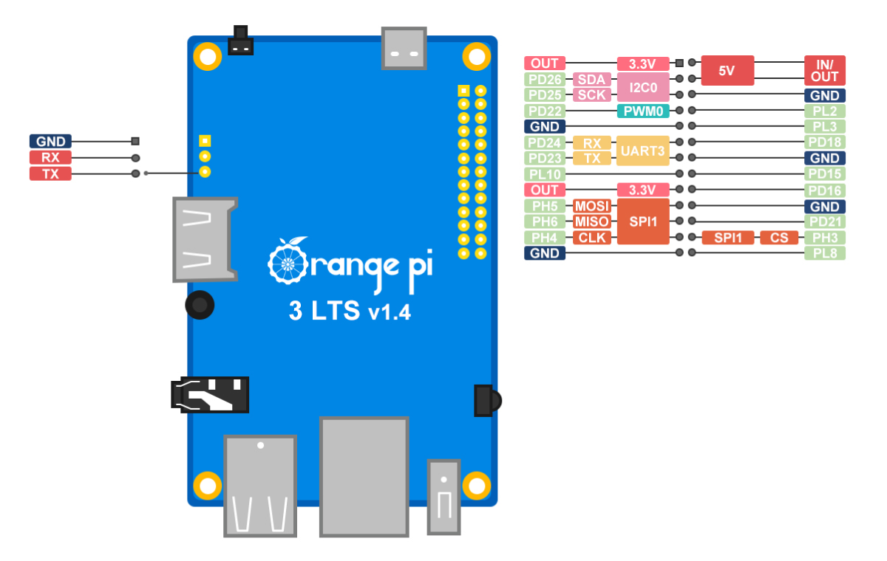

# Подключение ADXL345 через BluePill

## Зачем использовать BluePill

Для калибровки [Input Shaping](https://www.klipper3d.org/Measuring_Resonances.html) в Klipper есть возможность использовать акселерометр. На данный момент поддерживается [adxl345](./doc/adxl345.pdf) с подключением по SPI, а так же MPU-6000/9000 с подключением по I2C. Подключить акселерометр можно к любому mcu, в том числе к хосту с клиппером (через linux proccess mcu). Можно подключить к плате принтера и, если нет свободного аппаратного SPI, использовать программную эмуляцию. В обоих случаях (при подключении к хосту и при подключении к плате принтера) длина проводов до датчика получается достаточно большой. Иногда это приводит к проблемам с подключением. Для решения этой проблемы можно использовать отдельный mcu, который будет подключаться только для работы с акселерометром и подключать его к хосту по USB.

Наиболее удобным способом, на мой взгляд, является использование [RP2040-Zero](../pico_adx345/readme.md). Эта плата не очень распространена и её может не быть под рукой. В этом отношении, отладочная плата на stm32f103 BluePill гораздо доступнее. 

В этом описании я предполагаю, что у целевой аудитории нет опыта программирования stm32 и работы с stlink. Поэтому для прошивки платы будет использоваться UART, а все операции сделаны непосредственно с хоста с клиппером (в данном случае Orange Pi 3 LTS).

# Сборка прошивки BluePill

Для начала нужно собрать прошивку, которая будет работать внутри BluePill:

```
cd ~/klipper
make clean
make menuconfig
make
```

* "cd \~/klipper" - перейдет в каталог klipper в домашнем каталоге текущего пользователя ( "\~" будет заменена на /home/username) 
* "make clean" - очистит от результатов предыдущих сборок
* "make menuconfig" - запуск графического конфигуратора
* "make" - запустит процесс сборки прошивки


Параметры для сборки:

* Microcontroller Architecture: STMicroelectronics STM32
* Processor Model: STM32F103
* Bootloader offset: No bootloader
* Communication interface: USB on PA11/PA12

После сборки, готовая прошивка будет находится в ~/klipper/out/klipper.bin

# Прошивка BluePill

Микроконтроллеры семейства STM32 имеют встроенный загрузчик, записанный при производстве. Этот загрузчик невозможно стереть или повредить, он находится в отдельной области памяти. Этот загрузчик позволяет прошивать МК без использования программатора, через различные интерфейсы, в том числе USB, UART, CAN. К сожалению, в STM32F103 нет поддержки прошивки через USB. Встроенный загрузчик поддерживает прошивку только через UART. Используется USART1 на выводах PA10 (RX) и PA9 (TX). 



Для работы с UART на Orange PI 3 LTS необходимо включить его поддержку. Как видно из схемы выводов, доступен только UART3 на выводах PD24 и PD23. Для включения UART нужно добавить overlay в device tree. Для этого нужно в файл /boot/armbianEnv.txt добавить параметр "overlays=uart3".

Открываем для редактирования:

```
sudo nano /boot/armbianEnv.txt 
```

Если параметра overlays нет, то просто нужно добавить строку "overlays=uart3":

```
verbosity=1
bootlogo=false
console=both
disp_mode=1920x1080p60
overlay_prefix=sun50i-h6
rootdev=UUID=744f5f5c-30b2-4c6e-baf2-e77811681450
rootfstype=ext4
overlays=uart3
```

Если параметр overlays уже есть, то нужно добавить "uart3" через пробел, например:

```
verbosity=1
bootlogo=false
console=both
disp_mode=1920x1080p60
overlay_prefix=sun50i-h6
rootdev=UUID=744f5f5c-30b2-4c6e-baf2-e77811681450
rootfstype=ext4
overlays=spi-spidev1 uart3
```

После перезагрузки проверяем, что появился UART3:

```
sergey@orangepi3-lts:~$ dmesg |grep serial
[    2.717967] 5000000.serial: ttyS0 at MMIO 0x5000000 (irq = 35, base_baud = 1500000) is a 16550A
[    2.722228] 5000c00.serial: ttyS3 at MMIO 0x5000c00 (irq = 36, base_baud = 1500000) is a 16550A
[    4.786858] systemd[1]: Created slice system-serial\x2dgetty.slice.
```

* "dmesg" - выводит отладочные сообщения от ядра
* "grep serial" - сортирует вывод от dmesg и выводи только строки в которых есть слово serial

Как видно, есть два serial устройства ttyS0 и ttyS3. ttyS0 это отладочная консоль на UART0 (3 пина рядом с hdmi разъемом). А ttyS3 это добавленный UART3.

Соединение BluePill и Orange PI 3 LTS для прошивки:

| BluePill      | OrangePI 3 LTS |
| ----------- | ----------- | 
| 3.3V      | 3.3V      | 
| GND   | GND        | 
| PA10 (RX)   | PD23 (TX)       |
| PA9 (TX)   | PD24 (TX)        |

Для запуска BluePill в режиме загрузчика нужно перед подачей питания ногу обозначенную как boot0 притянуть к 3.3в. На bluepill для этого сделана отдельная перемычка. Её нужно переставить в положение "1", как на картинке:


Удобнее всего сделать все подключения при выключенной Orange PI 3 LTS, поставить перемычку на BluePill, но не подключать линию 3.3В. После включения Orange Pi и подключени по ssh, подключить 3.3в и проверить, что плата подключается:

```
sergey@orangepi3-lts:~$ sudo stm32flash /dev/ttyS3
stm32flash 0.5

http://stm32flash.sourceforge.net/

Interface serial_posix: 57600 8E1
Version      : 0x31
Option 1     : 0x00
Option 2     : 0x00
Device ID    : 0x0448 (STM32F070xB/F071xx/F72xx)
- RAM        : Up to 16KiB  (6144b reserved by bootloader)
- Flash      : Up to 128KiB (size first sector: 2x2048)
- Option RAM : 16b
- System RAM : 12KiB

```

Если подключение удалось, можно прошить плату собранной прошивкой:

```
sergey@orangepi3-lts:~$ sudo stm32flash -w ~/klipper/out/klipper.bin -v -g 0x0  /dev/ttyS3
stm32flash 0.5

http://stm32flash.sourceforge.net/

Using Parser : Raw BINARY
Interface serial_posix: 57600 8E1
Version      : 0x31
Option 1     : 0x00
Option 2     : 0x00
Device ID    : 0x0448 (STM32F070xB/F071xx/F72xx)
- RAM        : Up to 16KiB  (6144b reserved by bootloader)
- Flash      : Up to 128KiB (size first sector: 2x2048)
- Option RAM : 16b
- System RAM : 12KiB
Write to memory
Erasing memory
Wrote and verified address 0x08006178 (100.00%) Done.

Starting execution at address 0x08000000... done.

```

Если запись и проверка завершилась успешно, можно отключить BluePill от Orange PI, переставить обратно перемычку boot0 и попробовать подключить по USB. Перед подключением можно открыть лог, для отображения новых сообщений:

```
sergey@orangepi3-lts:~$ sudo tail -f /var/log/syslog
Mar  6 14:00:36 orangepi3-lts systemd[1]: sysstat-collect.service: Succeeded.
Mar  6 14:00:36 orangepi3-lts systemd[1]: Finished system activity accounting tool.
Mar  6 14:05:01 orangepi3-lts CRON[1819]: (root) CMD (command -v debian-sa1 > /dev/null && debian-sa1 1 1)
Mar  6 14:06:40 orangepi3-lts kernel: [ 1710.256178] usb 6-1: new full-speed USB device number 2 using ohci-platform
Mar  6 14:06:40 orangepi3-lts kernel: [ 1710.491231] usb 6-1: New USB device found, idVendor=1d50, idProduct=614e, bcdDevice= 1.00
Mar  6 14:06:40 orangepi3-lts kernel: [ 1710.491272] usb 6-1: New USB device strings: Mfr=1, Product=2, SerialNumber=3
Mar  6 14:06:40 orangepi3-lts kernel: [ 1710.491292] usb 6-1: Product: stm32f072xb
Mar  6 14:06:40 orangepi3-lts kernel: [ 1710.491308] usb 6-1: Manufacturer: Klipper
Mar  6 14:06:40 orangepi3-lts kernel: [ 1710.491323] usb 6-1: SerialNumber: 3A0037000657414131353320
Mar  6 14:06:40 orangepi3-lts kernel: [ 1710.517531] cdc_acm 6-1:1.0: ttyACM0: USB ACM device
Mar  6 14:06:40 orangepi3-lts kernel: [ 1710.517644] usbcore: registered new interface driver cdc_acm
Mar  6 14:06:40 orangepi3-lts kernel: [ 1710.517653] cdc_acm: USB Abstract Control Model driver for USB modems and ISDN adapters
```

После подключения USB кабеля с BluePill появятся сообщения от ядра (в примере выше после Mar  6 14:06:40). Как видно, появилось новое USB устройство с  Manufacturer: Klipper. Проверяем доступные serial устройства:

```
sergey@orangepi3-lts:~$ ls -l /dev/serial/by-id/
итого 0
lrwxrwxrwx 1 root root 13 мар  6 14:06 usb-Klipper_stm32f072xb_3A0037000657414131353320-if00 -> ../../ttyACM0
```

В моем случае, это тестовый стенд и есть всего одно устройство, подключенный BluePill. На реальном устройстве, может быть несколько устройств (например подключенная по USB плата принтера). Определить нужное устройство можно по серийному номеру, который был в выводе при подключении устройства и в его имени (SerialNumber: 3A0037000657414131353320).

# Настройка Klipper

Для того, чтобы можно было отключать bluepill, когда adxl не нужен, все настройки вынесены в отдельный файл adxl345.cfg:

```
[mcu bluepill]
serial: /dev/serial/by-id/usb-Klipper_stm32f072xb_3A0037000657414131353320-if00

[adxl345]
spi_bus: spi1
cs_pin: bluepill:PA4

[resonance_tester]
accel_chip: adxl345
probe_points:
    100, 100, 50  

```

В printer.cfg нужно добавить "[include adxl345.cfg]". Когда акселерометр не нужен и bluepill отключена, достаточно закомментировать эту строку.

Доступные шины "spi_bus" можно посмотреть в [коде klipper](https://github.com/Klipper3d/klipper/blob/master/src/stm32/spi.c). В данном случае используется набор spi1 и CS на PA4.

| ADXL345      | BluePill | Описание |
| ----------- | ----------- | ----------- |
| VCC      | 3.3V или 5V      | Питание датчика, 3.3В <br /> Если на плате с ADXL345 есть регулятор напряжения, можно использовать 5В.|
| GND   | GND        | Питание датчика, GND |
| CS   | PA4       | линия CS (Chip Select) |
| SDO   | PA6 | линия MISO (Master In Slave Out) |
| SDA   | PA7 | линия MOSI (Master Out Slave In) |
| SCL   | PA5 | линия тактирования CLK (CLOCK) |

Проверить работу акселерометра можно командой [ACCELEROMETER_QUERY](https://github.com/Klipper3d/klipper/blob/master/docs/G-Codes.md#accelerometer_query) в консоли klipper:

```
14:35:58 $ ACCELEROMETER_QUERY
14:36:00 // accelerometer values (x, y, z): 6365.771101, 6069.688724, 995.924147
```

