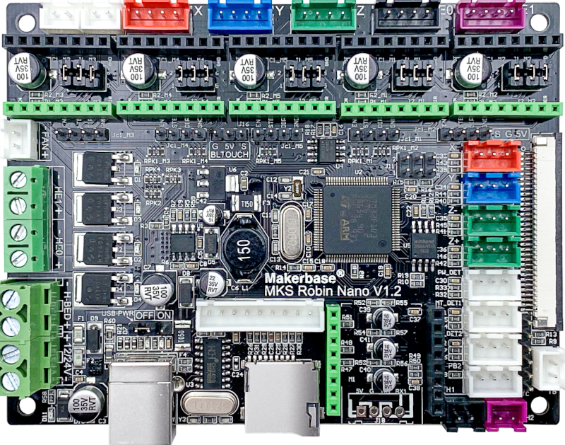
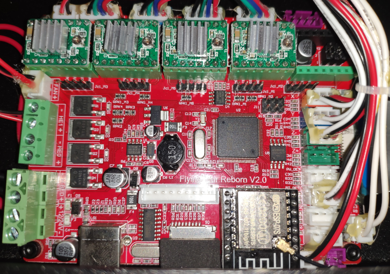
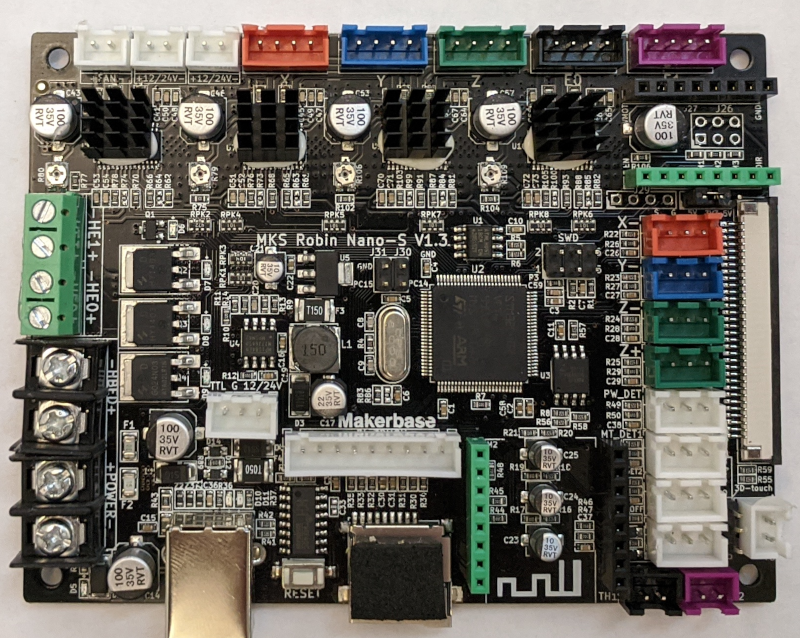
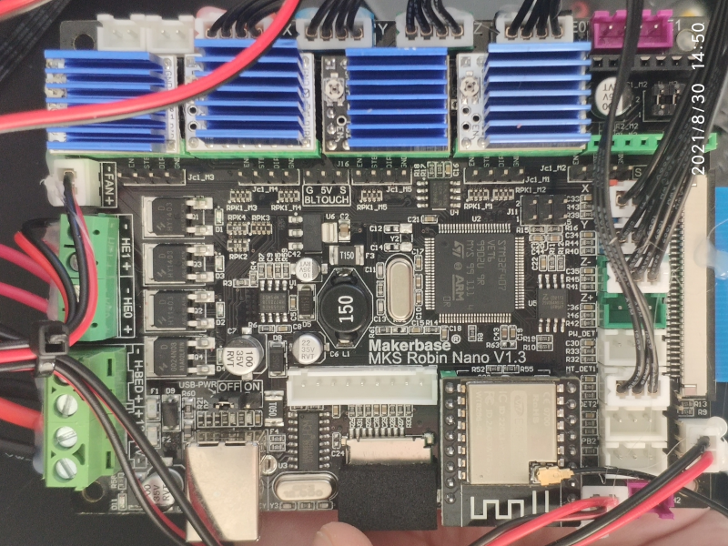
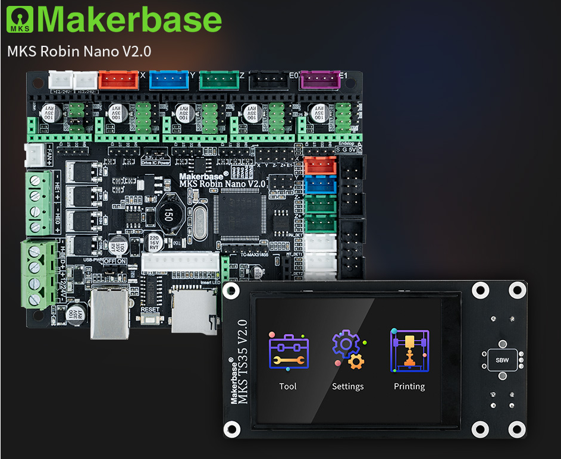
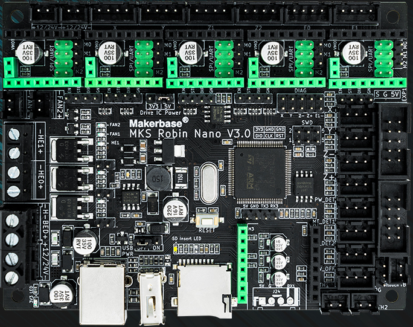

# Платы управления принтером Flying Bear 4S/5

В принтеры серии Flying Bear версий 4S и 5 устанавливается несколько видов плат управления. Все они производства компании [Makerbase](https://github.com/makerbase-mks). 

На все платы можно установить стороннюю прошивку - Marlin или Klipper

Описание плат содержит основные особенности платы:

* **МК:** установленный на плате микроконтроллер
* **Драйвера:** установленные на плате драйвера
* **Экран:** тип интерфейса подключения экрана
* **Bootloader:** загрузчик записанный в МК производителем, его размер и наличие шифрования основной прошивки. Файл загрузчика нужен только в случае замены МК.
* **Схема:** ссылка на схему платы
* **Стандартная прошивка:** ссылка на стандартную прошивку от Flying Bear
* **Дополнительно:** дополнительная информация о плате для использования сторонних прошивок.

## Robin Nano V1.1 и V1.2

* **МК:** STM32F103VET6 72Mhz, 512KB flash, 64KB Ram
* **Драйвера:** сменные. На 4S устанавливались 4 драйвера A4988, на 5 в разное время устанавливался разный набор драйверов: либо 2 драйвера A4988 + 2 драйвера TMC 2208, либо все 4 драйвера TMC 2208.
* **Экран:** параллельная 16-бит шина, FSMC
* **Bootloader:**
  * [Загрузчик](./robin_nano_v1/rn_v1_bootloader.bin) записан с начала flash, по адресу 0x08000000
  * Смещение основной прошивки - 0x7000 (28кб). Загрузчик использует шифрование основной прошивки.
  * В качестве алгоритма шифрования используется xor ключем {0xA3, 0xBD, 0xAD, 0x0D, 0x41, 0x11, 0xBB, 0x8D, 0xDC, 0x80, 0x2D, 0xD0, 0xD2, 0xC4, 0x9B, 0x1E, 0x26, 0xEB, 0xE3, 0x33, 0x4A, 0x15, 0xE4, 0x0A, 0xB3, 0xB1, 0x3C, 0x93, 0xBB, 0xAF, 0xF7, 0x3E} с 320 по 31040 байт основной прошики. Это шифрование уже добавлено в Marlin (автоматически при сборке) и Klipper (скрипт /scripts/update_mks_robin.py)

* **Схема:** [Схема](./robin_nano_v1/MKS_Robin_Nano_V1.1_SCH.pdf)
* **Стандартная прошивка:**
  * [2 драйвера А4988 и 2 драйвер 2208](./robin_nano_v1/firmware_v1_(4988+2208).zip)
  * [4 драйвера 2208](./robin_nano_v1/firmware_v1_(4x2208).zip)
* **Дополнительно:**
Различия плат MKS Robin Nano V1.1 и Flying Bear Reborn v2.0 отсутствуют, это фактически одна и таже плата. Основные отличия V1.2 в нативным подключением Bltouch и возможности отключить питание платы от USB.
В Marlin в параметре MOTHERBOARD нужно установить BOARD_MKS_ROBIN_NANO, в platformio.ini default_envs = mks_robin_nano35, тип экрана MKS_ROBIN_TFT35.

## Robin Nano-S V1.3

* **МК:** STM32F407VET6 168Mhz, 512KB flash, 192KB Ram
* **Драйвера:** на плате распаяно 4 драйвера TMC2225 и есть 1 слот под установку дополнительного драйвера.
* **Экран:** параллельная 16-бит шина, FSMC
* **Bootloader:**
  * [Загрузчик](./robin_nano_s_v13/nano_s_bootloader.bin) записан с начала flash, по адресу 0x08000000
  * Смещение основной прошивки 0x8000 (32кБ)
  * Шифрование не используется
* **Схема:** [Схема](./robin_nano_s_v13/MKS_Robin_Nano_S_V1.3.pdf)
* **Стандартная прошивка:** [Прошивка](./robin_nano_s_v13/firmware_s_v1.3.zip)
* **Дополнительно:** на данный момент поддержка платы в офф. репозиторий Marlin не добавлена. Тестовая поддержка платы добавлена в [сборку Marlin для принтеров FB](https://github.com/Sergey1560/Marlin_FB4S). В параметре MOTHERBOARD нужно установить BOARD_MKS_ROBIN_NANO_S_V13, в platformio.ini default_envs = mks_robin_nano_v1_3, тип экрана MKS_ROBIN_TFT35. Для использования сменного драйвера в качестве драйвера для экструдера, в файле Marlin/src/pins/stm32f4/pins_MKS_ROBIN_NANO_S_V13.h параметр EXT_EXTRUDER_DRIVER нужно установить в 1.

## Robin Nano V1.3

* **МК:** STM32F407VET6 168Mhz, 512KB flash, 192KB Ram
* **Драйвера:** 4 сменных драйвера
* **Экран:** параллельная 16-бит шина, FSMC
* **Bootloader:**
  * [Загрузчик](./robin_nano_v13/nano_v13_bootloader.bin) записан с начала flash, по адресу 0x08000000
  * Смещение основной прошивки 0x8000 (32кБ)
  * Шифрование не используется
* **Схема:** [Схема](./robin_nano_v13/MKS_Robin_Nano_V1.3_SCH.pdf)
* **Стандартная прошивка:** [Прошивка](./robin_nano_v13/firmware_v13.zip)
* **Дополнительно:** на данный момент поддержка платы в офф. репозиторий Marlin не добавлена. Тестовая поддержка платы добавлена в [сборку Marlin для принтеров FB](https://github.com/Sergey1560/Marlin_FB4S). В параметре MOTHERBOARD нужно установить BOARD_MKS_ROBIN_NANO_S_V13, в platformio.ini default_envs = mks_robin_nano_v1_3, тип экрана MKS_ROBIN_TFT35. Для использования сменного драйвера в качестве драйвера для экструдера, в файле Marlin/src/pins/stm32f4/pins_MKS_ROBIN_NANO_S_V13.h параметр EXT_EXTRUDER_DRIVER нужно установить в 1.

## Robin Nano V2.0

* **МК:** STM32F103VET6 72Mhz, 512KB flash, 64KB Ram
* **Драйвера:** 4 сменных драйвера с возможностью подключения по UART или SPI.
* **Экран:** последовательная шина, SPI с возможностью подключения как SPI-TFT так и SPI-LCD
* **Bootloader:**
  * [Загрузчик](./robin_nano_v2/Robin_nano_v2.0_boot_201116.hex)
* **Схема:** [Схема](./robin_nano_v2/MKS Robin Nano V2.0_001 SCH.pdf)
* **Стандартная прошивка:** Отсутствует. Flying Bear не стаят данную плату в свом принтеры.
* **Дополнительно:** Данную плата не совместима с экраном, оспользуемом в Nano V1.х. Плату лучше ставить вместе с экраном MKS TS35(SPI), однако, поддерживаются и экраны LCD12864,LCD2004, и подключаемые по UART. Поддержка платы в офф. репозиторий Marlin присутствует, но подключение по WIFI работает только на графическом интерфейсе TFT_LVGL_UI экрана MKS TS35(SPI). Поддержка работы WIFI на графических интерфейсах TFT_CLASSIC_UI и TFT_COLOR_UI добавлена в [сборке Marlin для принтеров FB](https://github.com/Sergey1560/Marlin_FB4S). В параметре MOTHERBOARD нужно установить BOARD_MKS_ROBIN_NANO_V2, в platformio.ini default_envs = mks_robin_nano35 , тип экрана MKS_TS35_V2_0 для TS35(SPI).
[Подробные особенности платы] (https://3dtoday.ru/blogs/x-dron/mks-robin-nano-20-novyy-khit).
[Опыт использования платы] (https://3dtoday.ru/blogs/x-dron/opyt-ustanovki-robin-nano-20-na-flyingbear-ghost-4s). За год показала себя с самой лучшей стороны.

## Robin Nano V3.0

* **МК:** STM32F407VET6 168Mhz, 512KB flash, 192KB Ram
* **Драйвера:** 4 сменных драйвера с возможностью подключения по UART или SPI.
* **Экран:** последовательная шина, SPI с возможностью подключения как SPI-TFT так и SPI-LCD
* **Bootloader:**
  * [Загрузчик](./robin_nano_v3/nano_v3_bootloader.bin)
* **Схема:** [Схема](./robin_nano_v3/MKS Robin Nano V3.0_004 SCH.pdf)
* **Стандартная прошивка:** Отсутствует. Flying Bear не стаят данную плату в свом принтеры.
* **Дополнительно:** Данную плата позиционируется как развитие Nano V2.0. Только развитие бестолковое. Поддержка платы в офф. репозиторий Marlin присутствует, но подключение по WIFI работает только на графическом интерфейсе TFT_LVGL_UI экрана MKS TS35(SPI). Поддержка работы WIFI на графических интерфейсах TFT_CLASSIC_UI и TFT_COLOR_UI нет. К применению не рекомендуется.
