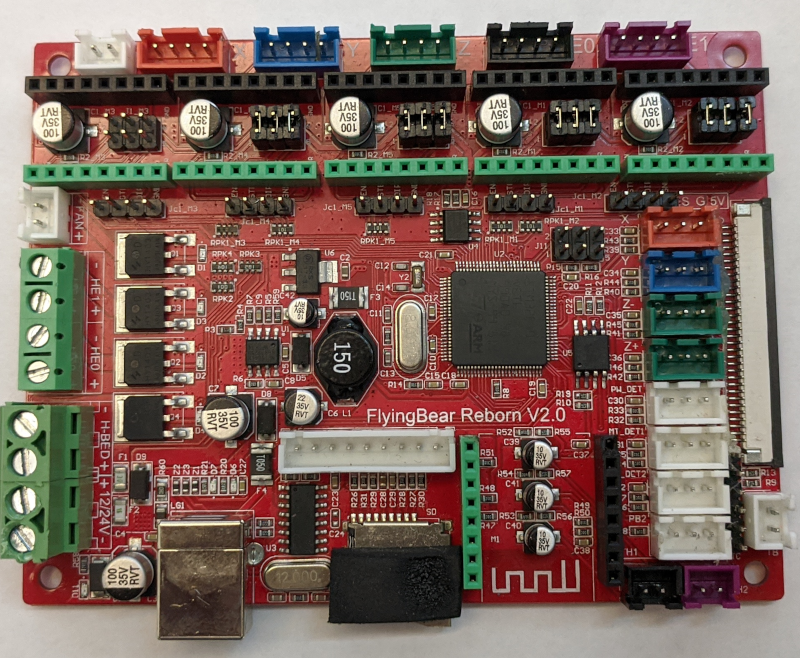

# Платы управления принтером Flying Bear 4S/5

В принтеры серии Flying Bear версий 4S и 5 устанавливается несколько видов плат управления. Все они производства компании [Makerbase](https://github.com/makerbase-mks). 

На все платы можно установить стороннюю прошивку - Marlin или Klipper

Описание плат содержит основные особенности платы:

* **МК:** установленный на плате микроконтроллер
* **Драйвера:** установленные на плате драйвера
* **Экран:** тип интерфейса подключения экрана
* **Bootloader:** загрузчик записанный в МК производителем, его размер и наличие шифрования основной прошивки. Файл загрузчика нужен только в случае замены МК.
* **Схема:** ссылка на схему платы
* **Стандартная прошивка:** ссылка на стандартную прошивку от Flying Bear
* **Дополнительно:** дополнительная информация о плате для использования сторонних прошивок.

## Robin Nano V1.1 и V1.2

* **МК:** STM32F103VET6 72Mhz, 512KB flash, 64KB Ram
* **Драйвера:** сменные. На 4S устанавливались 4 драйвера A4988, на 5 в разное время устанавливался разный набор драйверов: либо 2 драйвера A4988 + 2 драйвера TMC 2208, либо все 4 драйвера TMC 2208.
* **Экран:** параллельная 16-бит шина, FSMC
* **Bootloader:** [Загрузчик](./robin_nano_v1/rn_v1_bootloader.bin) записан с начала flash, по адресу 0x080000.
Смещение основной прошивки - 0x7000 (28кб). Загрузчик использует шифрование основной прошивки. В качестве алгоритма шифрования используется xor ключем {0xA3, 0xBD, 0xAD, 0x0D, 0x41, 0x11, 0xBB, 0x8D, 0xDC, 0x80, 0x2D, 0xD0, 0xD2, 0xC4, 0x9B, 0x1E, 0x26, 0xEB, 0xE3, 0x33, 0x4A, 0x15, 0xE4, 0x0A, 0xB3, 0xB1, 0x3C, 0x93, 0xBB, 0xAF, 0xF7, 0x3E} с 320 по 31040 байт основной прошики. Это шифрование уже добавлено в Marlin (автоматически при сборке) и Klipper (скрипт /scripts/update_mks_robin.py)

* **Схема:** [Схема](./robin_nano_v1/MKS Robin Nano V1.1_001 SCH.pdf)
* **Стандартная прошивка:**
[2 драйвера А4988 и 2 драйвер 2208](./robin_nano_v1/firmware_v1_(4988+2208).zip)
[4 драйвера 2208](./robin_nano_v1/firmware_v1_(4x2208).zip)
* **Дополнительно:**
Отличие плат MKS Robin Nano V1.1, V1.2 и Flying Bear Reborn v2.0 незначительны, это фактически одна и таже плата.
В Marlin в параметре board BOARD_MKS_ROBIN_NANO, в platformio.ini default_envs = mks_robin_nano35, тип экрана MKS_ROBIN_TFT35.
