# Подключение экрана от FB 4S/5 по SPI

На принтерах Flying Bear 4S/5 установлен экран на контроллере ILI9488 с тач панелью на контроллере xpt2046. В этой заметке рассказано о том, как подключить такой экран через последовательный интерфейс SPI.

## ILI9488

В [datasheet](./ds/mks_lcd/ds/ILI9488_Data_Sheet.pdf) на контроллер есть описание интерфейсов, с которыми работает этот контроллер.

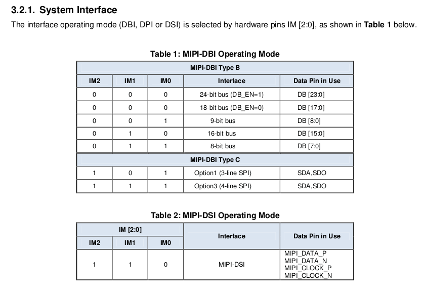

Комбинацией ног IM0 - IM2 можно задать необходимый интерфейс. Контроллер умеет работать и по SPI, но в данном случае изменить комбинацию ног не представляется возможным. Сам контроллер ILI9488 стоит где-то внутри экрана и снаружи его не видно. Сконфигурирован он для работы в режиме MIPI-DBI Type B, с шиной 16-бит.

16-бит это формат цвета RGB565, т.е. 5 бит используется на красный цвет, 6 бит на зеленый и 5 бит на голубой.

Для управления экраном также используются еще несколько ног:

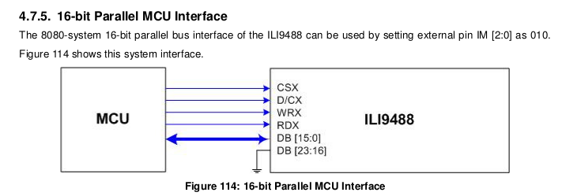

* CSX: линия chip select
* D/CX: выбор типа передаваемых данных - data или command
* RDX: признак того, что данные читаются из контроллера дисплея
* WRX: признак того, что данные записываются в контроллер дисплея

Запись в экран происходит следующим образом: на линиях данных DB0-DB15 выставляются нужные данные. Это может быть нужный цвет пикселя или нужная команда. Тип данных определяется состоянием ноги D/CX: если на ней низкий уровень, значит передается команда, если высокий - данные. По восходящему фронту на ноге WRX контроллер считывает данные с ног DB0-DB17. Поскольку на шине может быть несколько устройств, выбор активного происходит линией CSX. Когда на ней низкий уровень, значит устройство выбрано.

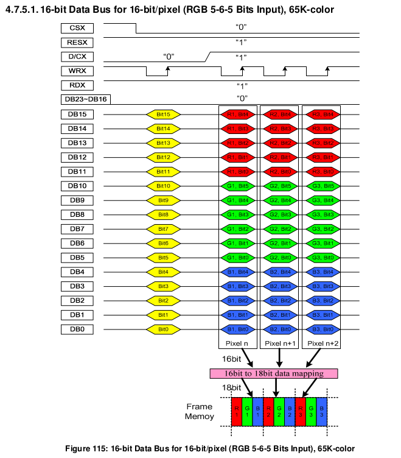

В микроконтроллерах STM32, которые используются на платах MKS Robin Nano, есть аппаратный блок FSMC, который позволяет удобно управлять экраном по такой шине, выдерживая все необходимые тайминги. Для подключения используются разъемы FPC32 с шагом 1мм.

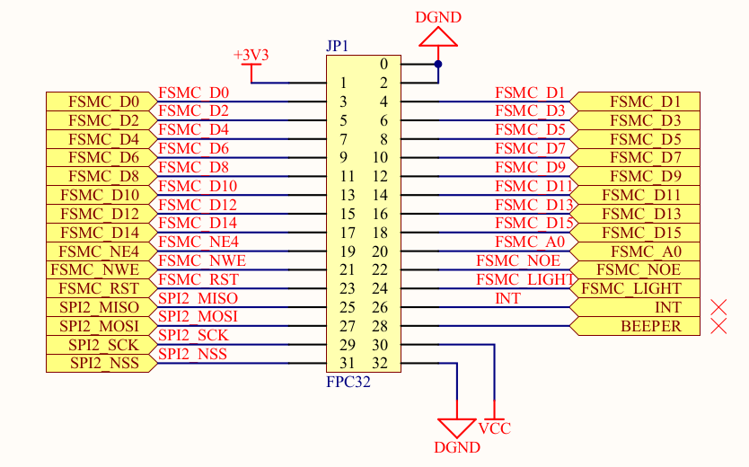

* FSMC_D0 - FSMC_D15: линии данных
* FSMC_NE4 - линия CS
* FSMC_NWE - линия WR
* FSMC_RST - линия соединеная с reset контроллера ili9488
* FSMC_A0 - линия D/C
* FSMC_NOE - линия RDX. Чтение не используется, поэтому эта линия всегда в высоком уровне.
* FSMC_LIGHT - управление подсветкой экрана

## Преобразование в SPI

На платах rapsberri pi и прочих SBC, как правило нет разъемов для подключения такого экрана, а в самом микроконтроллере может не быть аппаратного блока для управления шиной. Управлять экраном принудительно выставляя каждую из 16+2 ног - очень медленно.

Наилучшим вариантом было бы переключить ili9488 в режим SPI. Поскольку это не представляется возможным, было реализовано другое решение, с преобразованием параллельного интерфейса в последовательный. Схема эта срисована с китайских экранов для raspbery pi.

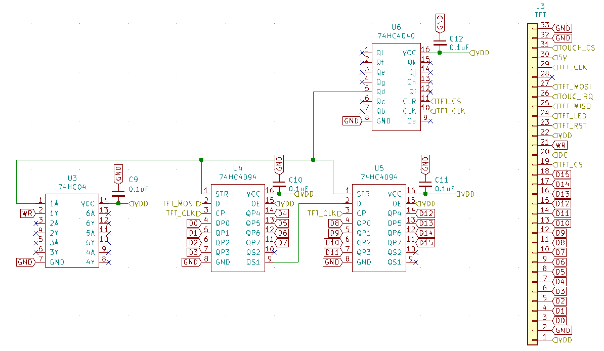

Экран работает только в режиме записи, чтение из него не происходит.

U4 и U5 - это сдвиговый регистр [74HC4094](./ds/74hc4094.pdf). У него есть 8 выводов (QP0 - QP7). На восходящем фронте на ноге CP с ноги D считываются данные. При установке STR в высокий уровень данные устанавливаются на выходах QP0 - QP7. Если передавать больше 8 бит, данные будут сдвигаться на ногу QS1. Это позволяет собирать каскад из регистров. В приведенной выше схеме, при передаче 16 бит, первые 8 бит будут "сдвинуты" через ногу QS1 микросхемы U4 на вход D микросхемы U5.

U6 - это счетчик [74HC4040](./ds/74hc4040.pdf) При каждом изменении уровня на ноге CLK из высокого уровня в низкий, счетчик увеличивает свое значение. Счетчик бинарный, на 12-бит. Высокий уровень на линии CLR сбрасывает счетчик в 0.

U3 - инвертор [74HC04](./ds/74рс04.pdf). У микросхемы есть 6 входов (ноги с индексом А), и 6 выходов (ноги с индексом Y). Если на входе высокий уровень, на выходе будет низкий, и наоборот.

Работа схемы:

* Линия CS подключена к выводу CLR счетчика. При высоком уровне CS (когда нет передачи по SPI), счетчик обнуляется.
* Передача по SPI начинается с опускания CS. Дальше на линию CLK выдвигаются 16 тактовых сигналов, при этом на MOSI выдвигаются данные. Линия MOSI подключена ко входу каскада из 2-х сдвиговых регистров. Таким образом, после 16 тактов на линии CLK, на выходах сдвиговых регистров установленны нужные 16 бит данных.
* Счетчик U6 считает импулься на линии CLK. Поскольку он сбрасывается высоким уровнем на CS, можно быть уверенным, что при опускании CS он начинает счет с 0. На выход Qd подключена линия STR сдвиговых регистров. Поскольку счетчик бинарный, после 8-го такта (8 в двоичной системе 1000), на 4 выводе (нога Qd) устанавливается 1. Т.е. линия STR поднимается в высокий уровень. Счетчик продолжает считать дальше, и пока счет не дойдет до 16, на выводе Qd остается 1 (15 в двоичной системе 1111). После 16-того такта вывод Qd статовится 0 (16 в двоичной системе 10000).
* Линия Qd также подключена ко входу инвертора U3. Когда счетчик доходит до 8 и на Qd устанавливается высокий уровень, на выходе инвертора устанавливается низкий. Когда счетчик доходит до 16, Qd устанавливается в низкий уровень, а на выходе инвертора устанавливается высокий. Таким образом формируется сигнал WR - по переходу из низкого уровня в высокий контроллер ILI9488 считывает данные установленные на выходах сдвиговых регистров.

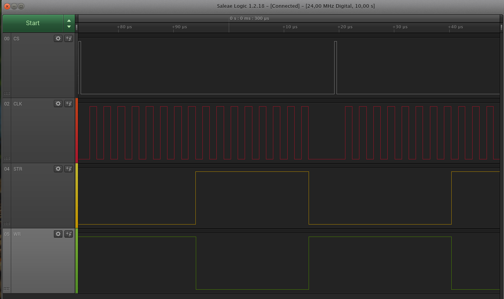

## Touch панель

На экране установлен простой резистивный тач на контроллере [XPT2046](./ds/XPT2046.pdf) (или его клоне). У контроллера есть выход IRQ (PENIRQ), который сигнализирует о том, что было нажатие.

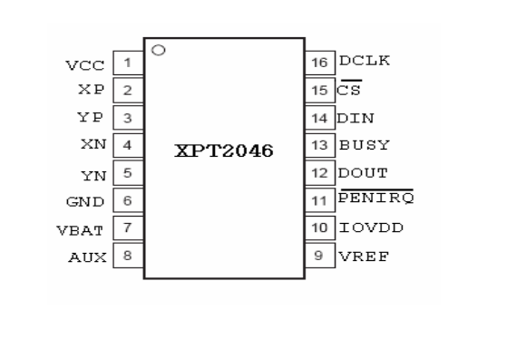

На плате экрана этот вывод подтянут к VDD через резистор R1. При нажатии на экран на этом выводе устанавливается низкий уровень. К сожалению на плате экрана не разведена дорожка от ноги PENIRQ до ноги на FPC32 разьеме шлейфа. В шлейше этот сигнал заложен (26 нога разъёма).

Прошивки принтера на базе марлин работают с тач-панелью в режиме опроса. Микроконтроллер несколько сот раз в секунду опрашивает XPT2046, не случилось ли нажатие.

В ядре линукса есть драйвер для XPT2046 (аналог ADS7846). Однако драйвер расчитан работу по прерыванию: опрос xpt2046 происходит только если изменился уровень на выводе IRQ (т.е. было нажатие).

Для работы тач панели в линуксе нужно допаять перемычку от ноги FPC разъема до ноги PENIRQ xtp2046.

На фотографии видно, что нога на FPC разъеме никуда не подключена:

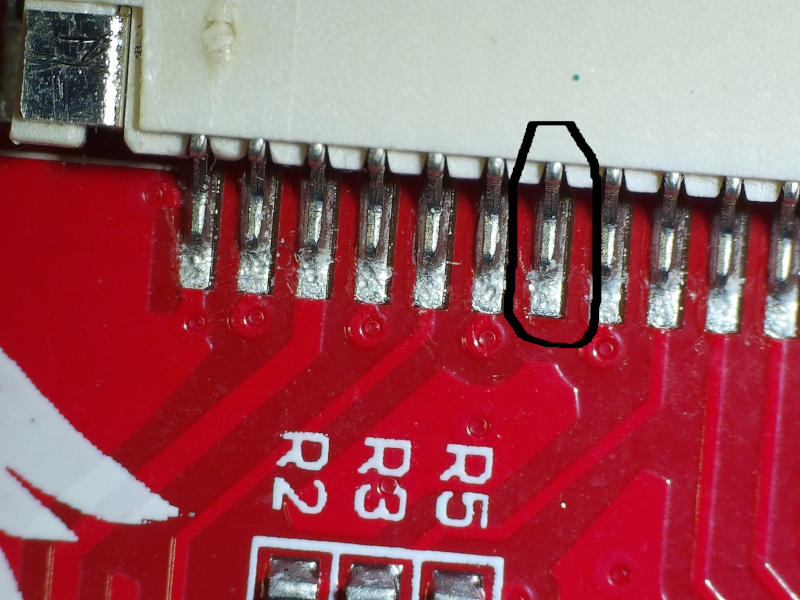

Вывод PENIRQ и резистор подтяжки R1:

Перемычка:

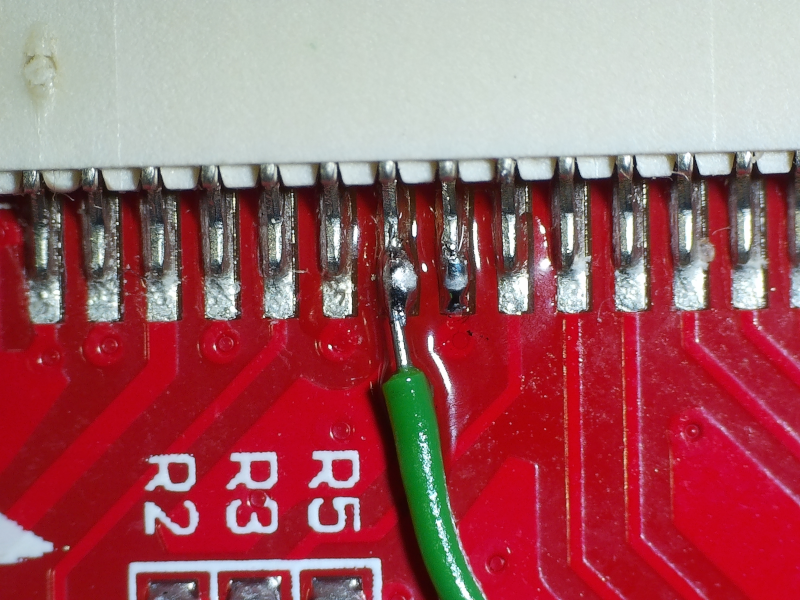

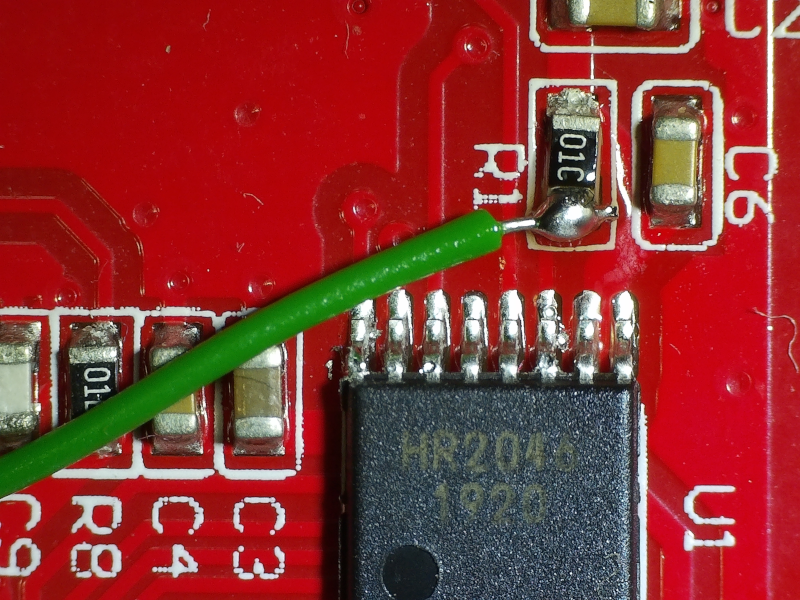

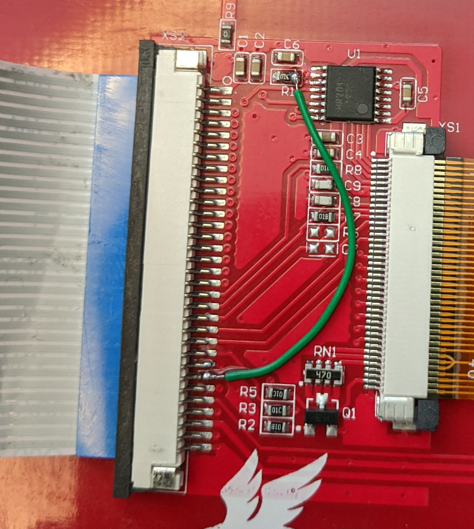
