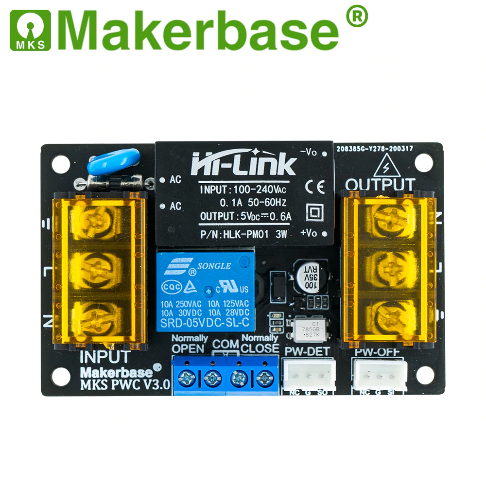
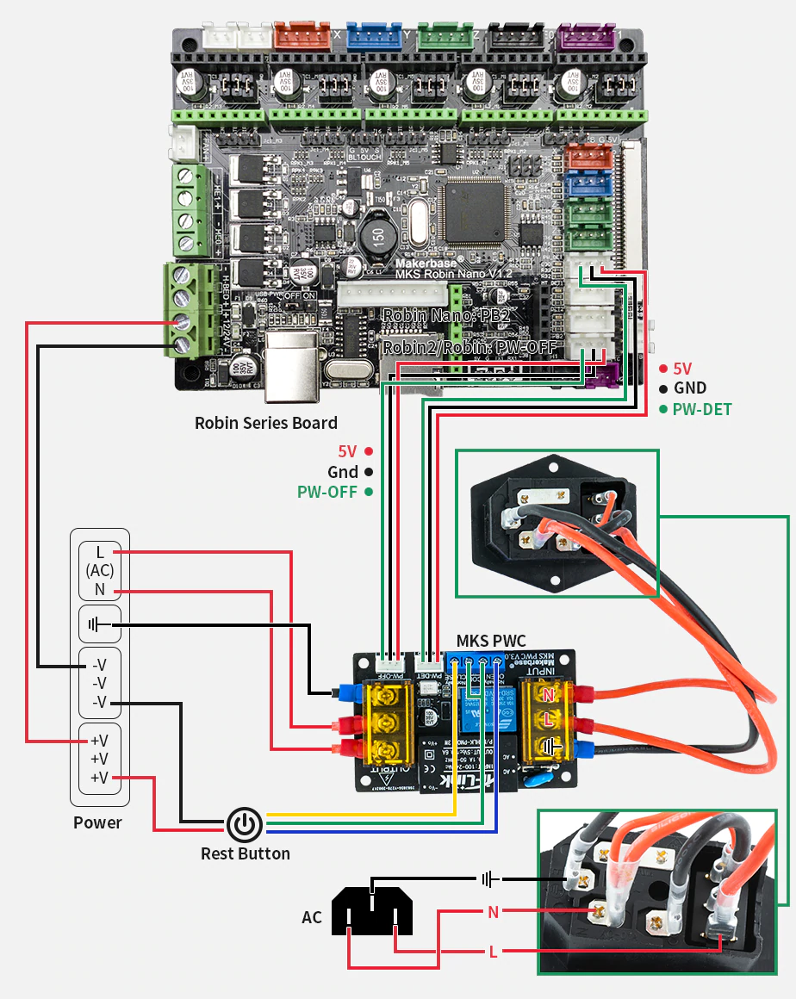

# Подключение модуля управления питанием MKS PWC v3.0

Модуль в [магазине MKS](https://aliexpress.ru/item/32853300039.html)

Данный модуль предназначен для управления питанием 3D принтера. Он ставится в разрыв сети 220В, перед блоком питания принтера. Позволяет отключать питание в аварийных случаях (выход температуры за установленные пределы) и при окончании печати. Так же позволяет определять отключение питания, и возобновить печать после появления питания. Схема подключения, предлагаемая MKS:

