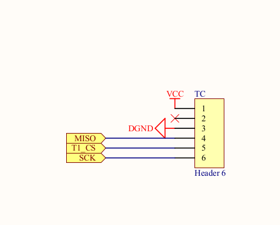

# Подключение модуля управления питанием MKS PWC v3.0


Модуль в [магазине MKS](https://aliexpress.ru/item/32853300039.html)

Данный модуль предназначен для управления питанием 3D принтера.

Он устанавливается в разрыв сети 220В, перед блоком питания принтера. Позволяет отключать питание в аварийных случаях (выход температуры за установленные пределы) и при окончании печати. Так же позволяет определять отключение питания, и возобновить печать после появления питания. Схема подключения, предлагаемая MKS:


## Схема работы модуля

Модуль представляет из себя нормально разомкнутое реле и схему управления им. При включении питания, реле разомкнуто, на выходе модуля нет питания. Кнопка включения так же не имеет фиксации, в отпущенном состоянии разомкнута. При нажатии на кнопку (на схеме Rest button) реле включается, на выходе модуля появляется 220В. Запускается плата управления принтером. На ноге PWR-OFF устанавливается высокий уровень. Кнопку можно отпустить, реле удерживается уровнем на ноге PWR-OFF.

Когда нужно отключить питание, на ноге PWR-OFF устанавливается низкий уровень и реле размыкается.

Нога PWR-DET предназначена для работы механизма POWER_LOSS_RECOVERY в Marlin. Во время печати, в начале каждого слоя, на SD карте сохраняется информация о состоянии печати. При включении, если на карте найден файл неоконченной печати, будет предложено продолжить печать.

В момент отключения питания уровень на ноге PWR-DET станет низким. За счет ёмкости на выходе блока питания, плата упраления принтером может определить факт пропадания питания (по уровню на ноге PWR-DET) и сохранить информацию о текущей печати.

## Настройка Marlin

Для управления питанием используется функционал "SUICIDE". Для включения, надо задать в файле Marlin/src/pins/stm32f1/pins_MKS_ROBIN_NANO.h значение SUICIDE_PIN, а также логический уровень управления SUICIDE_PIN_INVERTING.

Для настройки функционала POWER_LOSS_RECOVERY нужно в файле Marlin/Configuration_adv.h включить #define POWER_LOSS_RECOVERY и установить POWER_LOSS_PIN.

## Подключение модуля к принтеру FB4S (robin nano 1.1), практический опыт

Я подключал модуль к плате, которая использует [bltouch](../bltouch/readme.md), поэтому предлагаемый разъем PB2 для ноги PWR-OFF был уже занят. Для ноги PWR-DET есть специальный разъем на плате, он обозначен PWR-DET (PA2). Я не использую функционал POWER_LOSS_RECOVERY, поэтому работу этой функции не проверял.

Разница между разъемом PB2 и разъемами PWR-DET, MT-DET1, MT-DET2 в том, что "DET" разъемы используются как вход и на них стоит делитель напряжения, для подключения 5V устройств (резисторы R32 - R37 номиналом 10К).

На PB2 делителя нет, только токоограничивающий резистор (R38 номинало 100).


Для управления PWR-OFF можно заменить резистор на одной из линий *DET, а можно использовать разъем TC, который находится рядом. Он предназначен для управления каким-то SPI устройством, но в случае FB4S свободен. Можно использовать ногу T1_CS (PE5) в качестве PWR-OFF.



Настройки Marlin, файл Marlin/src/pins/stm32f1/pins_MKS_ROBIN_NANO.h

```
#define SUICIDE_PIN                       PE5
#define SUICIDE_PIN_INVERTING false
```

Если нужно POWER_LOSS_RECOVERY, то нужно задать так же:
```
#define PWR_DET_PIN                         PA2
```

И в Marlin/Configuration_adv.h:

```
#define POWER_LOSS_RECOVERY
  #if ENABLED(POWER_LOSS_RECOVERY)
    #define PLR_ENABLED_DEFAULT   false // Power Loss Recovery enabled by default. (Set with 'M413 Sn' & M500)
    //#define BACKUP_POWER_SUPPLY       // Backup power / UPS to move the steppers on power loss
    //#define POWER_LOSS_ZRAISE       2 // (mm) Z axis raise on resume (on power loss with UPS)
    #define POWER_LOSS_PIN         PWR_DET_PIN // Pin to detect power loss. Set to -1 to disable default pin on boards without module.
    #define POWER_LOSS_STATE     LOW // State of pin indicating power loss
    //#define POWER_LOSS_PULL           // Set pullup / pulldown as appropriate
    //#define POWER_LOSS_PURGE_LEN   20 // (mm) Length of filament to purge on resume
    //#define POWER_LOSS_RETRACT_LEN 10 // (mm) Length of filament to retract on fail. Requires backup power.

    // Without a POWER_LOSS_PIN the following option helps reduce wear on the SD card,
    // especially with "vase mode" printing. Set too high and vases cannot be continued.
    #define POWER_LOSS_MIN_Z_CHANGE 0.05 // (mm) Minimum Z change before saving power-loss data
  #endif
```

## Применение

Выключение в случае выхода температуры за установленны пределы будет происходить автоматически.

Для отключения питания можно использовать команду [M81](https://marlinfw.org/docs/gcode/M081.html) или [M112](https://marlinfw.org/docs/gcode/M112.html). В слайсере, в финишный код, можно добавить:
```
M109 R50 #Установить температуру хотенда 50 градусов и дождаться её установки.
M81 #выключить питание
```
