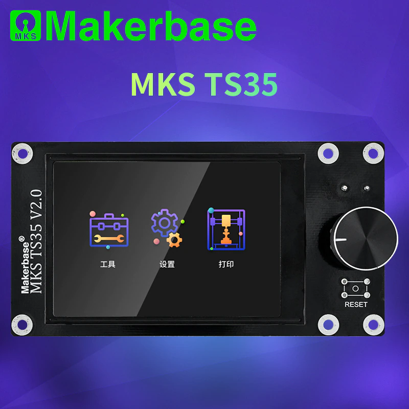
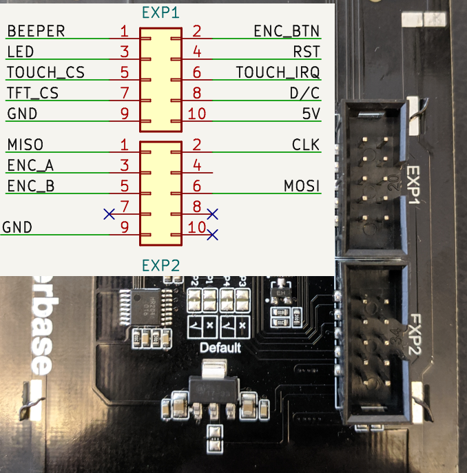
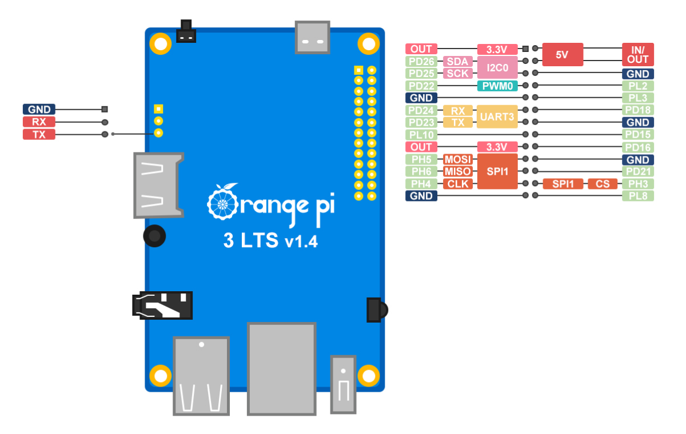
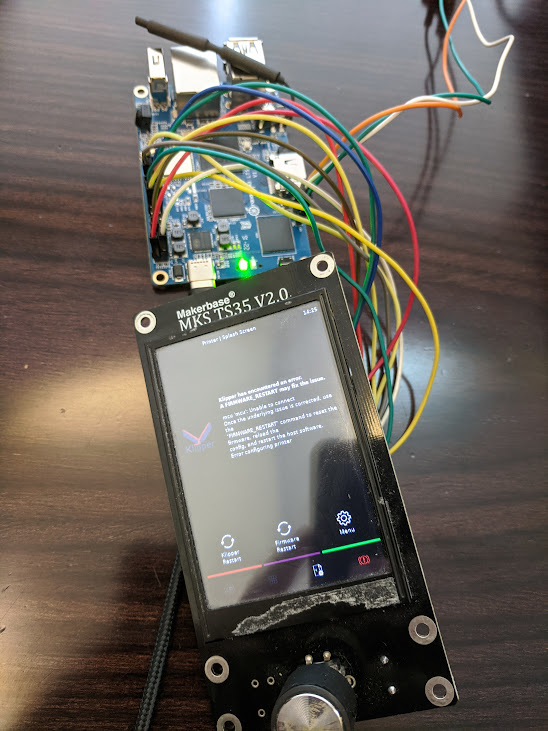

# Подключение экрана MKS TS35 V2.0 к Orange Pi

## MKS TS35 V2.0



Экран MKS TS35 V2.0 используется с платами Robin Nano 2.0 На принтерах Flying Bear6 установлен аналогичный экран, но без энкодера. 

Экран сделан на контроллере Sitronix st7796s. Контроллер может работать в различных режимах (параллельный, последовательный), но на плате установлены настройки для работы по SPI. Тач сделан на аналоге xpt2046, подключен к этой же шине SPI.

Схема экрана есть на [гитхабе MKS](https://github.com/makerbase-mks/MKS-TFT-Hardware/tree/master/MKS%20TS35/MKS%20TS35%20V2.0_001)

Для подключения используются две колодки, обозначенные как EXP1 и EXP2. Назначение контактов:



Уровни на всех выводах 3.3В. На плате установлен понижающий преобразователь, питание 5В.

## Подключение к Orange Pi 3 LTS



```
MOSI      PH5 SPI1_MOSI
MISO      PH6 SPI1_MISO
CLK       PH4 SPI1_CLK
TFT_CS    PL8
DC        PD15 
RST       PD16
TOUCH_CS  PH3
TOUCH_IRQ PL10
LED       3.3V
```

В ядре нет подходящего драйвера для контроллера st7796s. Есть [пример настройки на raspberry pi](https://github.com/willngton/3DPrinterConfig/blob/main/mks_ts35/mks_ts35_guide_archived.md) с драйвером tinylcd35. Однако в mainline ядре такого драйвера нет, и сам автор говорит, что "This guide have been archived due some kernel changes on raspbian mainline kernel".

Сам по себе чипсет достаточно типовой, отличается только инициализация экрана. Поэтому можно собрать драйвер в виде внешнего модуля ядра.

Для сборки модуля понадобится пакет build-essential и linux-headers. Для linux-headers нужно определить архитектуру процессора:

```
root@orangepi3-lts:~# uname -a
Linux orangepi3-lts 5.15.63-sunxi64 #trunk SMP Tue Aug 30 11:31:51 UTC 2022 aarch64 GNU/Linux
```

Архитектура указана после версии ядра. В данном случае sunxi64. 

Если архитектура отличается, список доступных пакетов можно псмотреть командой:

```
sudo apt-cache search linux-headers-current-sunxi64
```

Установка необходимых пакетов:

```
sudo apt update
sudo apt install git build-essential linux-headers-current-sunxi64
```

Клонирование репозитория с кодом драйвера:

```
git clone https://github.com/Sergey1560/fb_st7796s.git
cd fb_st7796s/kernel_module/
```

Сборка драйвера:

```
make
sudo make install
make clean
sudo depmod -A
```

При копировании драйвера (команда make install) компилятор сообщит об ошибках "SSL error". Их можно игнорировать.

Для того, чтобы драйвер загружался при старте системы, его нужно добавить в initramfs. Для этого нужно добавить название драйвера в /etc/initramfs-tools/modules и обновить сжатый образ initramfs:

```
sudo bash -c 'echo "fb_st7796s" >> /etc/initramfs-tools/modules'
sudo update-initramfs -u
```

Проверить, что драйвер был добавлен:

```
sudo lsinitramfs /boot/initrd.img-5.15.48-sunxi64 |grep fb
```

Для загрузки драйвера нужно указать ядру к каким ногам подключен экран и тач, а так же включить SPI. Делается это через device tree. Для Orange Pi 3 LTS есть готовый файл:

```
cd ../dts/
sudo armbian-add-overlay sun50i-h6-st7796s.dts
```

На этом можно перезагрузить систему и убедиться, что экран работает:

```
sudo reboot
```

После перезагрузки должно появиться изображение на экране и отладочные сообщения в выводе ядра. Посмотреть можно так:

```
dmesg|grep 7796
dmesg|grep 7846
```

Проверить работает ли touch можно при помощи evtest.

## Настройка Xorg и KlipperScreen

Предполагается, что KlipperScreen установлен через [kiauh](https://github.com/th33xitus/kiauh). После установки нужно заменить используемый Xorg драйвер и поправить конфигурацию.

В /etc/X11/Xwrapper.config нужно добавить:

```
allowed_users=anybody
needs_root_rights=yes
```

Замена драйвера:

```
sudo systemctl stop KlipperScreen.service
sudo mv /etc/X11/xorg.conf.d/50-fbturbo.conf /etc/X11/xorg.conf.d/50-fbdev.conf
sudo apt-get remove xserver-xorg-video-fbturbo
sudo apt-get install xserver-xorg-video-fbdev
```

В файле /etc/X11/xorg.conf.d/50-fbdev.conf изменить Driver на fbdev:

```
Section "Device"
        Identifier      "Allwinner FBDEV"
        Driver          "fbdev"
        Option          "fbdev" "/dev/fb0"

        Option          "SwapbuffersWait" "true"
EndSection
```

Для работы с тачем нужно добавить конфигурацию в файл /etc/X11/xorg.conf.d/51-touch.conf :

```
Section "InputClass"
        Identifier "ADS7846 Touchscreen"
        MatchIsTouchscreen "on"
        MatchDevicePath "/dev/input/event*"
        Driver "libinput"
    	Option "TransformationMatrix" "0 1 0 1 0 0 0 0 1"
        Option	"SwapXY"	"1"
        Option	"InvertX"	"1"
        Option	"InvertY"	"1"
EndSection
```

И установить пакет xserver-xorg-input-libinput:

```
sudo apt install xserver-xorg-input-libinput
```

Ориентация тач панели задается параметром TransformationMatrix. Настройки выше сделаны для экрана расположенного вертикально, как на Flying Bear 6.

Для проверки работы KlipperScreen можно запустить его вручную, с выводом сообщений в терминал:

```
xinit /home/sergey/.KlipperScreen-env/bin/python /home/sergey/KlipperScreen/screen.py
```

Если все запускается и работает, можно прервать процесс сочетание кнопок ctrl+c и запустить его как сервис:

```
sudo systemctl start KlipperScreen.service 
```

Если нужно настроить поворот тач панели это можно сделать не перезапуская KlipperScreen. Посмотреть текущую матрицу:

```
DISPLAY=:0.0 xinput list-props 'ADS7846 Touchscreen' | grep "Coordinate Transformation Matrix
```

Применить новую:

```
DISPLAY=:0.0 xinput --set-prop 'ADS7846 Touchscreen' 'Coordinate Transformation Matrix' 0 -1 1 1 0 0 0 0 1
```

Описание [Coordinate Transformation Matrix](https://wiki.ubuntu.com/X/InputCoordinateTransformation). Стандартные матрицы для поворота указаны так же в [wiki KlipperScreen](https://klipperscreen.readthedocs.io/en/latest/Installation/).
Если нужно инвертировать одну ось, можно воспользоваться [online калькулятором матриц](https://matrixcalc.org/). [Пример расчета](https://unix.stackexchange.com/questions/685039/x11-how-to-invert-axis-on-touchscreen-matrix).

Если нужна калибровка экрана, нужно установить пакет xinput-calibrator. Получение номера устройства для калбировки:

```
sergey@orangepi3-lts:~$ DISPLAY=:0 xinput_calibrator --list
Device "ADS7846 Touchscreen" id=6
```

Запуск калибровки:

```
sergey@orangepi3-lts:~$ DISPLAY=:0 xinput_calibrator -v --device 6
```

На перекрестия лучше нажимать чем-то более тонким чем палец, например стилусом. В результате в терминале будет выведен результат ввиде пример конфигурации. Можно просто добавить параметры MinX, MaxX, MinY, MinY в /etc/X11/xorg.conf.d/51-touch.conf

