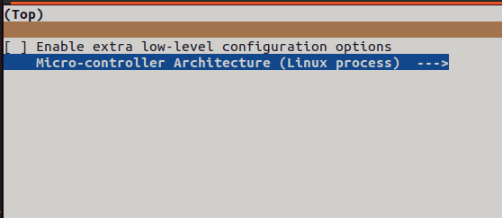

# Подключение акселерометра ADX345 к Orange Pi 3 LTS

Данная заметка описывает подключение акселерометра ADXL345 к Orange PI 3 LTS. Я постарался описать общий подход к настройке, чтобы это можно было сделать на любом другом SBC. В качестве примера используется Armbian на debian 11 Bullsey (Armbian_22.11.1_Orangepi3-lts_bullseye_current_5.15.80_minimal) и дистрибутив от Orange Pi (Orangepi3-lts_3.0.8_debian_bullseye_server_linux5.16.17.img).

Есть два варианта подключения - с использованием аппаратного блока SPI и программная эмуляция. Если есть свободный аппаратный блок, лучше использовать его. Если на SBC нет SPI или его ноги чем-то заняты, можно использовать любые свободные ноги gpio и программную эмуляцию. В данной заметке описаны оба способа.

## Плата, подключение


На плате есть доступный аппаратный блок SPI1 на ногах PH3-PH6. 

| ADX345      | OrangePI 3 LTS | Описание |
| ----------- | ----------- | ----------- |
| VCC      | 3.3V       | Питание датчика, 3.3В |
| GND   | GND        | Питание датчика, GND |
| CS   | PH3 CS       | линия chip select |
| SDO   | PH6 MISO        | линия Master In Slave Out |
| SDA   | PH5 MOSI        | линия Master Out Slave In |
| CLK   | PH4 CLK        | линия тактирования |

Выходы INT1 и INT2 на adxl345 не используются.

## Использование аппаратного блока SPI

Для использования нужного аппаратного блока SPI нужно его включить. А так же нужно включить интерфейс драйвера SPI для доступа из пространства пользователя (spidev). Все это делается через device tree overlay. В данном случае, уже есть готовые .dbto файлы, ничего писать самостоятельно не нужно. Достаточно лишь указать нужный файл в параметре overlay. Делается это в файле /boot/armbianEnv.txt в Armbian или в файле /boot/orangepiEnv.txt в случае использования дистрибутива от OrangePi.

В файл нужно добавить "overlays=spi-spidev1". Если параметр "overlays" там уже есть, то spi-spidev1 нужно добавить в него через пробел, например: "overlays=uart1 spi-spidev1". Так же нужно добавить параметры, какой конкретно блок SPI нужно влкючить. Как видно со схемы выводов Orange Pi 3 LTS, на ногах PH3, PH4, PH5, PH6 используется SPI1, поэтому нужно указать "param_spidev_spi_bus=1".

Таким образом, для дистрибутива от Orange Pi файл /boot/orangepiEnv.txt изначально выглядел:

```
verbosity=1
bootlogo=false
console=both
disp_mode=1920x1080p60
overlay_prefix=sun50i-h6
rootdev=UUID=42f0b789-8459-423f-8e3b-d894477ae96d
rootfstype=ext4
usbstoragequirks=0x2537:0x1066:u,0x2537:0x1068:u
```

Нужно открыть файл для редактирования:

```
sudo nano /boot/orangepiEnv.txt
```

И добавить в него параметры "overlays=spi-spidev1" и "param_spidev_spi_bus=1":

```
verbosity=1
bootlogo=false
console=both
disp_mode=1920x1080p60
overlay_prefix=sun50i-h6
rootdev=UUID=42f0b789-8459-423f-8e3b-d894477ae96d
rootfstype=ext4
usbstoragequirks=0x2537:0x1066:u,0x2537:0x1068:u
overlays=spi-spidev1
param_spidev_spi_bus=1
```

В случае Armbian, содержимое файла /boot/armbianEnv.txt до редактирования:

```
sergey@orangepi3-lts:~$ cat /boot/armbianEnv.txt 
verbosity=1
bootlogo=false
console=both
disp_mode=1920x1080p60
overlay_prefix=sun50i-h6
rootdev=UUID=53123900-5c68-4243-bf63-411c870e4a90
rootfstype=ext4
```

Открываем для редактирования:

```
sudo nano /boot/armbianEnv.txt 
```

/boot/armbianEnv.txt после редактирования:

```
verbosity=1
bootlogo=false
console=both
disp_mode=1920x1080p60
overlay_prefix=sun50i-h6
rootdev=UUID=53123900-5c68-4243-bf63-411c870e4a90
rootfstype=ext4
overlays=spi-spidev1
param_spidev_spi_bus=1
```

После перезагрузки, во время старта uboot (если подключен монитор или консоль по uart), можно увидеть, что указанный dbto применился:

```
Applying kernel provided DT overlay sun50i-h6-spi-spidev1.dtbo
```

Проверяем, что нужное устройство появилось:

```
orangepi@orangepi3-lts:~/klipper$ ls -l /dev/spidev*
crw------- 1 root root 153, 0 Feb  1 09:41 /dev/spidev1.0
```

Для подключения к линиям хоста нужно добавить mcu:

```
cd ~/klipper
make clean
make menuconfig
make
make flash
```



* "make clean" очищает остатки от предыдущих сборок. 
* "make menuconfig" позволяет настроить параметры сборки прошивки в графическом интерфесе. 
* "make" компилирует прошивку в папке out. 
* "make flash" копирует скомпилированный файл в /usr/local/bin.

Для автоматического запуска процесса при старте системы, нужно добавить его в systemd. Готовый service-файл уже есть в klipper, достаточно его просто скопировать:

```
sudo cp ~/klipper/scripts/klipper-mcu.service /etc/systemd/system/
```

Включаем автозагрузку:

```
orangepi@orangepi3-lts:~/klipper$ sudo systemctl enable klipper-mcu
Created symlink /etc/systemd/system/multi-user.target.wants/klipper-mcu.service → /etc/systemd/system/klipper-mcu.service.
```

Запуск сервиса:

```
sudo systemctl start klipper-mcu
```

Перезагружаем, проверяем, что сервис запущен:

```
orangepi@orangepi3-lts:~$ ps -aux|grep klipper_mcu
root         631  0.0  0.0   2440   624 ?        Ss   10:00   0:00 /usr/local/bin/klipper_mcu -r -I /tmp/klipper_host_mcu
orangepi    1614  0.0  0.0   5904   732 pts/2    S+   10:01   0:00 grep klipper_mcu
```

В конфигурацию klipper добавляем mcu с именем host:

```
[mcu host]
serial: /tmp/klipper_host_mcu
```

Конфигурация ADXL345:

```
[adxl345]
cs_pin: host:None
spi_bus: spidev1.0
```

В данном примере линия CS подключена к аппаратному CS SPI1 (PH3 на схеме). В связи с этим, явно нога для CS не указана (cs_pin: host:None). То, что акселерометр подключен к mcu с именем host указано в пути cs_pin - *host*:None. 

Проверка акселерометра:

```
ACCELEROMETER_QUERY
// accelerometer values (x, y, z): -1406.391290, 6809.894666, 6588.421283
```

## Программная эмуляция SPI

Если нет свободного аппаратного блока SPI можно использовать программную эмуляцию. В этом случае можно использовать любые свободные gpio ноги. Для примера, я буду использовать те же ноги PH3, PH4, PH5, PH6, что использовались в примере с аппаратным SPI. Для того, чтобы отключить эти ноги от аппаратного SPI из orangepiEnv.txt (armbianEnv.txt) нужно убрать "spi-spidev1" из overlays. После перезагрузки устройства /dev/spidev1.0 не будет. Если в overlays ничего не добавляли, то и убирать не нужно.

Проверяем права на gpio:

```
orangepi@orangepi3-lts:~$ ls -l /dev/gpiochip*
crw------- 1 root root 254, 0 Feb  1 10:11 /dev/gpiochip0
crw------- 1 root root 254, 1 Feb  1 10:11 /dev/gpiochip1
```

Как видно, по-умолчанию права на доступ имеет только root. Для доступа от пользователя под которым работает клиппер, добавляем группу gpio:

```
sudo groupadd gpio
```

Добавляем пользователя в эту группу (в примере пользователь orangepi, нужно заменить на нужного):

```
sudo usermod -a -G gpio orangepi
```

Для изменения владельца при запуске системы нужно добавить правило udev:

```
echo "SUBSYSTEM==\"gpio\", KERNEL==\"gpiochip[0-4]\", GROUP=\"gpio\", MODE=\"0660\"" |sudo tee -a  /etc/udev/rules.d/97-gpio.rules
```

Применяем новые правила и проверяем права доступа:

```
sudo udevadm control --reload-rules
sudo udevadm trigger
```

Проверяем, что новые правила применились и группа изменилась:

```
orangepi@orangepi3-lts:~$ ls -l /dev/gpiochip*
crw-rw---- 1 root gpio 254, 0 Feb  1 10:17 /dev/gpiochip0
crw-rw---- 1 root gpio 254, 1 Feb  1 10:17 /dev/gpiochip1
```

Для того, чтобы к текущему пользователю применилась добавленная группа gpio нужно выйти из системы и залогиниться снова. После этого можно проверить работу.

Для чуть более удобной работы нужно установить gpiod:

```
sudo apt-get install gpiod
```

Смотрим доступные gpiochip и их адреса:

```
orangepi@orangepi3-lts:~$ gpiodetect 
gpiochip0 [7022000.pinctrl] (64 lines)
gpiochip1 [300b000.pinctrl] (256 lines)
```

Как видно, есть gpiochip0 по адресу 7022000 на котором 64 gpio линии и gpiochip1 по адресу 300b000. Чтобы определить, на каком gpiochip находится нужная нога (в данном случае интересует PH3-PH6), посмотрим, какие линии, где находятся.

```
orangepi@orangepi3-lts:~$  sudo ls /sys/kernel/debug/pinctrl
300b000.pinctrl  7022000.pinctrl  pinctrl-devices  pinctrl-handles  pinctrl-maps
```

300b000 это gpiochip1, 7022000 это gpiochip0. Смотрим линии:

```
orangepi@orangepi3-lts:~$ sudo cat /sys/kernel/debug/pinctrl/300b000.pinctrl/pinmux-pins
Pinmux settings per pin
Format: pin (name): mux_owner gpio_owner hog?
pin 0 (PA0): (MUX UNCLAIMED) (GPIO UNCLAIMED)
pin 1 (PA1): (MUX UNCLAIMED) (GPIO UNCLAIMED)
pin 2 (PA2): (MUX UNCLAIMED) (GPIO UNCLAIMED)
pin 3 (PA3): (MUX UNCLAIMED) (GPIO UNCLAIMED)
pin 4 (PA4): (MUX UNCLAIMED) (GPIO UNCLAIMED)
pin 5 (PA5): (MUX UNCLAIMED) (GPIO UNCLAIMED)
pin 6 (PA6): (MUX UNCLAIMED) (GPIO UNCLAIMED)
pin 7 (PA7): (MUX UNCLAIMED) (GPIO UNCLAIMED)
pin 8 (PA8): (MUX UNCLAIMED) (GPIO UNCLAIMED)
pin 9 (PA9): (MUX UNCLAIMED) (GPIO UNCLAIMED)
pin 32 (PB0): (MUX UNCLAIMED) (GPIO UNCLAIMED)
pin 33 (PB1): (MUX UNCLAIMED) (GPIO UNCLAIMED)
pin 34 (PB2): (MUX UNCLAIMED) (GPIO UNCLAIMED)
pin 35 (PB3): (MUX UNCLAIMED) (GPIO UNCLAIMED)
pin 36 (PB4): (MUX UNCLAIMED) (GPIO UNCLAIMED)
pin 37 (PB5): (MUX UNCLAIMED) (GPIO UNCLAIMED)
pin 38 (PB6): (MUX UNCLAIMED) (GPIO UNCLAIMED)
pin 39 (PB7): (MUX UNCLAIMED) (GPIO UNCLAIMED)
pin 40 (PB8): (MUX UNCLAIMED) (GPIO UNCLAIMED)
pin 41 (PB9): (MUX UNCLAIMED) (GPIO UNCLAIMED)
pin 42 (PB10): (MUX UNCLAIMED) (GPIO UNCLAIMED)
pin 43 (PB11): (MUX UNCLAIMED) (GPIO UNCLAIMED)
pin 44 (PB12): 508f000.i2s (GPIO UNCLAIMED) function i2s3 group PB12
pin 45 (PB13): 508f000.i2s (GPIO UNCLAIMED) function i2s3 group PB13
pin 46 (PB14): 508f000.i2s (GPIO UNCLAIMED) function i2s3 group PB14
pin 47 (PB15): 508f000.i2s (GPIO UNCLAIMED) function i2s3 group PB15
pin 48 (PB16): 508f000.i2s (GPIO UNCLAIMED) function i2s3 group PB16
pin 49 (PB17): 5002c00.i2c (GPIO UNCLAIMED) function i2c3 group PB17
pin 50 (PB18): 5002c00.i2c (GPIO UNCLAIMED) function i2c3 group PB18
pin 51 (PB19): ac200_clk (GPIO UNCLAIMED) function pwm1 group PB19
pin 52 (PB20): (MUX UNCLAIMED) (GPIO UNCLAIMED)
pin 64 (PC0): (MUX UNCLAIMED) (GPIO UNCLAIMED)
pin 65 (PC1): 4022000.mmc (GPIO UNCLAIMED) function mmc2 group PC1
pin 66 (PC2): (MUX UNCLAIMED) (GPIO UNCLAIMED)
pin 67 (PC3): (MUX UNCLAIMED) (GPIO UNCLAIMED)
pin 68 (PC4): 4022000.mmc (GPIO UNCLAIMED) function mmc2 group PC4
pin 69 (PC5): 4022000.mmc (GPIO UNCLAIMED) function mmc2 group PC5
pin 70 (PC6): 4022000.mmc (GPIO UNCLAIMED) function mmc2 group PC6
pin 71 (PC7): 4022000.mmc (GPIO UNCLAIMED) function mmc2 group PC7
pin 72 (PC8): 4022000.mmc (GPIO UNCLAIMED) function mmc2 group PC8
pin 73 (PC9): 4022000.mmc (GPIO UNCLAIMED) function mmc2 group PC9
pin 74 (PC10): 4022000.mmc (GPIO UNCLAIMED) function mmc2 group PC10
pin 75 (PC11): 4022000.mmc (GPIO UNCLAIMED) function mmc2 group PC11
pin 76 (PC12): 4022000.mmc (GPIO UNCLAIMED) function mmc2 group PC12
pin 77 (PC13): 4022000.mmc (GPIO UNCLAIMED) function mmc2 group PC13
pin 78 (PC14): 4022000.mmc (GPIO UNCLAIMED) function mmc2 group PC14
pin 79 (PC15): (MUX UNCLAIMED) 300b000.pinctrl:79
pin 80 (PC16): (MUX UNCLAIMED) (GPIO UNCLAIMED)
pin 96 (PD0): 5020000.ethernet (GPIO UNCLAIMED) function emac group PD0
pin 97 (PD1): 5020000.ethernet (GPIO UNCLAIMED) function emac group PD1
pin 98 (PD2): 5020000.ethernet (GPIO UNCLAIMED) function emac group PD2
pin 99 (PD3): 5020000.ethernet (GPIO UNCLAIMED) function emac group PD3
pin 100 (PD4): 5020000.ethernet (GPIO UNCLAIMED) function emac group PD4
pin 101 (PD5): 5020000.ethernet (GPIO UNCLAIMED) function emac group PD5
pin 102 (PD6): (MUX UNCLAIMED) 300b000.pinctrl:102
pin 103 (PD7): 5020000.ethernet (GPIO UNCLAIMED) function emac group PD7
pin 104 (PD8): 5020000.ethernet (GPIO UNCLAIMED) function emac group PD8
pin 105 (PD9): 5020000.ethernet (GPIO UNCLAIMED) function emac group PD9
pin 106 (PD10): 5020000.ethernet (GPIO UNCLAIMED) function emac group PD10
pin 107 (PD11): 5020000.ethernet (GPIO UNCLAIMED) function emac group PD11
pin 108 (PD12): 5020000.ethernet (GPIO UNCLAIMED) function emac group PD12
pin 109 (PD13): 5020000.ethernet (GPIO UNCLAIMED) function emac group PD13
pin 110 (PD14): (MUX UNCLAIMED) 300b000.pinctrl:110
pin 111 (PD15): (MUX UNCLAIMED) (GPIO UNCLAIMED)
pin 112 (PD16): (MUX UNCLAIMED) (GPIO UNCLAIMED)
pin 113 (PD17): (MUX UNCLAIMED) (GPIO UNCLAIMED)
pin 114 (PD18): (MUX UNCLAIMED) (GPIO UNCLAIMED)
pin 115 (PD19): 5020000.ethernet (GPIO UNCLAIMED) function emac group PD19
pin 116 (PD20): 5020000.ethernet (GPIO UNCLAIMED) function emac group PD20
pin 117 (PD21): (MUX UNCLAIMED) (GPIO UNCLAIMED)
pin 118 (PD22): (MUX UNCLAIMED) (GPIO UNCLAIMED)
pin 119 (PD23): (MUX UNCLAIMED) (GPIO UNCLAIMED)
pin 120 (PD24): (MUX UNCLAIMED) (GPIO UNCLAIMED)
pin 121 (PD25): (MUX UNCLAIMED) (GPIO UNCLAIMED)
pin 122 (PD26): (MUX UNCLAIMED) (GPIO UNCLAIMED)
pin 160 (PF0): 4020000.mmc (GPIO UNCLAIMED) function mmc0 group PF0
pin 161 (PF1): 4020000.mmc (GPIO UNCLAIMED) function mmc0 group PF1
pin 162 (PF2): 4020000.mmc (GPIO UNCLAIMED) function mmc0 group PF2
pin 163 (PF3): 4020000.mmc (GPIO UNCLAIMED) function mmc0 group PF3
pin 164 (PF4): 4020000.mmc (GPIO UNCLAIMED) function mmc0 group PF4
pin 165 (PF5): 4020000.mmc (GPIO UNCLAIMED) function mmc0 group PF5
pin 166 (PF6): (MUX UNCLAIMED) 300b000.pinctrl:166
pin 192 (PG0): 4021000.mmc (GPIO UNCLAIMED) function mmc1 group PG0
pin 193 (PG1): 4021000.mmc (GPIO UNCLAIMED) function mmc1 group PG1
pin 194 (PG2): 4021000.mmc (GPIO UNCLAIMED) function mmc1 group PG2
pin 195 (PG3): 4021000.mmc (GPIO UNCLAIMED) function mmc1 group PG3
pin 196 (PG4): 4021000.mmc (GPIO UNCLAIMED) function mmc1 group PG4
pin 197 (PG5): 4021000.mmc (GPIO UNCLAIMED) function mmc1 group PG5
pin 198 (PG6): (MUX UNCLAIMED) (GPIO UNCLAIMED)
pin 199 (PG7): (MUX UNCLAIMED) (GPIO UNCLAIMED)
pin 200 (PG8): (MUX UNCLAIMED) (GPIO UNCLAIMED)
pin 201 (PG9): (MUX UNCLAIMED) (GPIO UNCLAIMED)
pin 202 (PG10): (MUX UNCLAIMED) (GPIO UNCLAIMED)
pin 203 (PG11): (MUX UNCLAIMED) (GPIO UNCLAIMED)
pin 204 (PG12): (MUX UNCLAIMED) (GPIO UNCLAIMED)
pin 205 (PG13): (MUX UNCLAIMED) (GPIO UNCLAIMED)
pin 206 (PG14): (MUX UNCLAIMED) (GPIO UNCLAIMED)
pin 224 (PH0): 5000000.serial (GPIO UNCLAIMED) function uart0 group PH0
pin 225 (PH1): 5000000.serial (GPIO UNCLAIMED) function uart0 group PH1
pin 226 (PH2): (MUX UNCLAIMED) 300b000.pinctrl:226
pin 227 (PH3): (MUX UNCLAIMED) 300b000.pinctrl:227
pin 228 (PH4): (MUX UNCLAIMED) 300b000.pinctrl:228
pin 229 (PH5): (MUX UNCLAIMED) 300b000.pinctrl:229
pin 230 (PH6): (MUX UNCLAIMED) 300b000.pinctrl:230
pin 231 (PH7): (MUX UNCLAIMED) 300b000.pinctrl:231
pin 232 (PH8): 6000000.hdmi (GPIO UNCLAIMED) function hdmi group PH8
pin 233 (PH9): 6000000.hdmi (GPIO UNCLAIMED) function hdmi group PH9
pin 234 (PH10): 6000000.hdmi (GPIO UNCLAIMED) function hdmi group PH10
```

Как видно, PH3-PH6 находятся на этом gpiochip1 и они свободны (нет назначенной функции). Так же, стоит отметить номер линий PH3 - 227, PH4 - 228, PH5 - 229, PH6 - 230, они понадобятся в конфигурации клиппера.

Определить номер линии так же можно из названия. Номер линии из имени пина получается по формуле: (позиция буквы в алфавите - 1) x32 + номер пина. Например PH3 будет (8 - 1) x 32 + 3 = 224 + 3 = 227. 

Конфигурция klipper:

```
[adxl345]
cs_pin: host:gpiochip1/gpio227
spi_software_sclk_pin:host:gpiochip1/gpio228
spi_software_mosi_pin:host:gpiochip1/gpio229
spi_software_miso_pin:host:gpiochip1/gpio230
```


## Дополнительно про образ от OrangePI

При использовании образа от Orange PI, пакетный менеджер apt использует зеркала для загрузки пакетов из Китая. В моем случае, скорость загрузки оттуда была практически нулевой. Чтобы ускорить процесс, я заменил используемое зеркало на что-то поближе. Если вас устраивает скорость загрузки с китайских зеркал, этого можно и не делать. К подключению adx345 это не имеет отношения.

Содержимое /etc/apt/sources.list:

```
orangepi@orangepi3-lts:~$ cat /etc/apt/sources.list
deb http://mirrors.tuna.tsinghua.edu.cn/debian bullseye main contrib non-free
#deb-src http://mirrors.tuna.tsinghua.edu.cn/debian bullseye main contrib non-free

deb http://mirrors.tuna.tsinghua.edu.cn/debian bullseye-updates main contrib non-free
#deb-src http://mirrors.tuna.tsinghua.edu.cn/debian bullseye-updates main contrib non-free

deb http://mirrors.tuna.tsinghua.edu.cn/debian bullseye-backports main contrib non-free
#deb-src http://mirrors.tuna.tsinghua.edu.cn/debian bullseye-backports main contrib non-free

deb http://mirrors.tuna.tsinghua.edu.cn/debian-security bullseye-security main contrib non-free
#deb-src http://mirrors.tuna.tsinghua.edu.cn/debian-security bullseye-security main contrib non-free
```

Сохраняю копию, заменяю используемое зеркало с mirrors.tuna.tsinghua.edu.cn на, например, mirror.yandex.ru:

```
orangepi@orangepi3-lts:~$ sudo cp /etc/apt/sources.list /etc/apt/sources.list.dist
orangepi@orangepi3-lts:~$ cat /etc/apt/sources.list.old |sed 's/mirrors.tuna.tsinghua.edu.cn/mirror.yandex.ru/g'|sudo tee /etc/apt/sources.list
```

Проверяю, что зеркало заменено, обновляю кэш apt:

```
orangepi@orangepi3-lts:~$ sudo cat /etc/apt/sources.list
deb http://mirror.yandex.ru/debian bullseye main contrib non-free
#deb-src http://mirror.yandex.ru/debian bullseye main contrib non-free

deb http://mirror.yandex.ru/debian bullseye-updates main contrib non-free
#deb-src http://mirror.yandex.ru/debian bullseye-updates main contrib non-free

deb http://mirror.yandex.ru/debian bullseye-backports main contrib non-free
#deb-src http://mirror.yandex.ru/debian bullseye-backports main contrib non-free

deb http://mirror.yandex.ru/debian-security bullseye-security main contrib non-free
#deb-src http://mirror.yandex.ru/debian-security bullseye-security main contrib non-free


orangepi@orangepi3-lts:~$ sudo apt update
Hit:1 http://mirror.yandex.ru/debian bullseye InRelease
Hit:2 http://mirror.yandex.ru/debian bullseye-updates InRelease
Hit:3 http://mirror.yandex.ru/debian bullseye-backports InRelease
Hit:4 http://mirror.yandex.ru/debian-security bullseye-security InRelease
Reading package lists... Done
Building dependency tree... Done
Reading state information... Done
All packages are up to date.
```