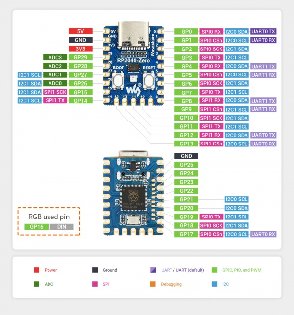
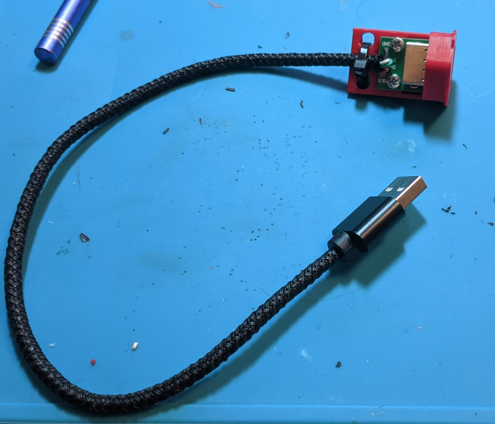
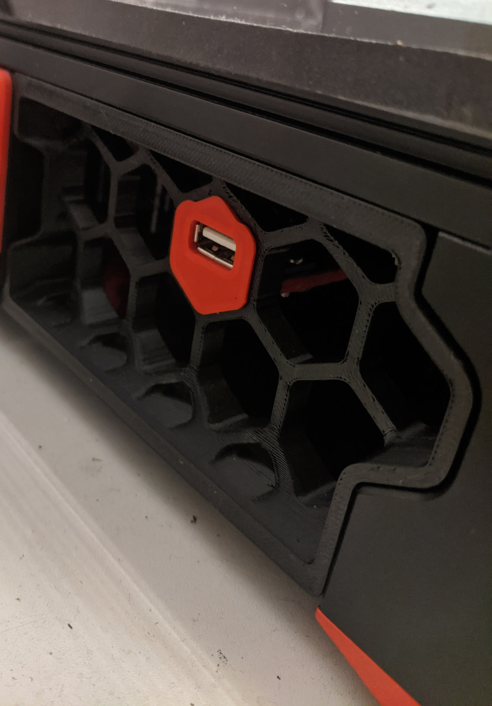
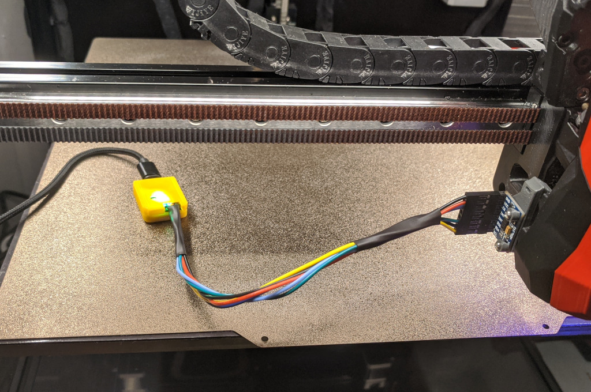

# Подключение ADXL345 через RP2040-Zero

## Зачем использовать RP2040-Zero

Для калибровки [Input Shaping](https://www.klipper3d.org/Measuring_Resonances.html) в Klipper есть возможность использовать акселерометр. На данный момент поддерживаются [adxl345](./doc/adxl345.pdf) с подключением по SPI, а так же MPU-6000/9000 с подключением по I2C. Подключить акселерометр можно к любому mcu, в том числе к хосту с клиппером (через linux proccess mcu). Можно подключить к плате принтера и, если нет свободного аппаратного SPI, использовать программную эмуляцию. В обоих случаях (при подключении к хосту и при подключении к плате принтера) длина проводов до датчика получается достаточно большой. Иногда это приводит к проблемам с подклчением. Для решения этой проблемы можно использовать отдельный mcu, который будет подключаться только для работы с акселерометром и подключать его к зосту по USB.

## Почему именно RP2040-Zero

Можно использовать любую отладочную плату на архитектуре, которую поддерживает клиппер. Это может быть и ардуино, и bluepill и любая другая плата. В данном случае, [RP2040-Zero](https://www.waveshare.com/wiki/RP2040-Zero) была выбрана по следующим причинам:

* Наличие USB, Type-C разъем
* Плата небольшого размера, ничего лишнего
* Для первоначальной прошивки не нужны никакие дополнительные устройства
* На плату есть описание, схема, 3д модель на [wiki](https://www.waveshare.com/wiki/RP2040-Zero) производителя

## Подключение ADXL345

У RP2040 есть 2 аппаратных шины SPI, которые могут быть подключены к разным пинам:



Все доступные варианты можно посмотреть в [src/rp2040/spi.c](https://github.com/Klipper3d/klipper/blob/master/src/rp2040/spi.c). Я выбрал для подключения шину spi1a и CS на gpio9: CLK - GP10, MOSI (обозначен SPI TX) - GP11, MISO (обозначен SPI RX) - GP12, CS - GP9. 

На акселерометре нужно подключить VCC к 3.3V, GND к GND, SDO к SPI TX, SDI к SPI RX, CS к CS.

## Сборка прошивки под RP2040

Сборка прошивки ничем не отличается от любого другого mcu. 

```
cd ~/klipper/
make meuconfig
```

В качестве Micro-controller Architecture нужно выбрать Raspberry Pi RP2040. Остальные параметры менять не нужно. Bootloader не нужен, должен стоять No bootloader.

```
make
```

## Подключение RP2040-Zero к клипперу по USB

Для первоначальной прошивки платы нужно подключить ее по USB к хосту, удерживая кнопку Boot. В системе появится новый диск, как правило /dev/sda

Для прошивки платы достаточно просто скопировать на нее прошивку. Для этого нужно подключить "диск":

```
sudo mount /dev/sda1 /mnt
```

И скопировать собранную прошивку:

```
sudo cp ~/klipper/out/klipper.uf2 /mnt
sudo umount /mnt
```

Плата сама перезагрузится, из системы пропадет диск /dev/sda, но появится новое USB устройство:

```
sergey@orange:~/klipper$ ls /dev/serial/by-id/*
/dev/serial/by-id/usb-Klipper_stm32f446xx_2F0046001550324E31333220-if00
/dev/serial/by-id/usb-Klipper_rp2040_E660B4404B137D36-if00
```
Устройство в имени которого есть rp2040 это подключенная плата.

## Конфигурация Klipper

Поскольку mcu с rp2040 нужен только на время использования акселерометра, все его настройки я вынес в один файл adxl345.cfg

```
[mcu pico]
serial: /dev/serial/by-id/usb-Klipper_rp2040_E660B4404B137D36-if00

[adxl345]
spi_bus: spi1a
cs_pin: pico:gpio9

[resonance_tester]
accel_chip: adxl345
probe_points:
    100, 100, 50  

[neopixel rpi2040]
pin: pico:gpio16
chain_count: 3
initial_RED: 0.1
initial_GREEN: 0.5
initial_BLUE: 0.0
color_order: GRB
```

На плате установлен светодиод ws2812, его цветом можно управлять.

В printer.cfg нужно добавить:

```
[include adxl345.cfg]
```

Когда акселерометр не используется, mcu rp2040 можно просто отключить. В printer.cfg достаточно закоментировать строку с include.

## Обновление прошивки MCU

Для обновления прошивки mcu, когда плата уже прошита klipper, не обязательно использовать кнопку Boot. Клиппер сам умеет перезагрузаться в режим обновления. Для обновления прошивки нужно выполнить:

```
make clean
make menuconfig
make
make flash FLASH_DEVICE=/dev/serial/by-id/usb-Klipper_rp2040_E660B4404B137D36-if00
```

Для того, чтобы не вспоминать команды каждый раз, можно использовать скрипт. 

```
#!/bin/bash

KLIPPER_DIR="/home/klipper/klipper"
KLIPPER_MCU_CONFIG_DIR="/home/klipper/printer_data/tools/update/mcu_config"
KLIPPER_MCU_CONFIG_RPI="${KLIPPER_MCU_CONFIG_DIR}/config.rpi2040"
RPI_DEVICE="/dev/serial/by-id/usb-Klipper_rp2040_E660B4404B137D36-if00"

echo -e "Stopping services Klipper"
sudo systemctl stop klipper

cd ${KLIPPER_DIR}

echo "Start update RPI2040 mcu"
echo "MCU: ${KLIPPER_MCU_CONFIG_RPI}"
make clean KCONFIG_CONFIG=${KLIPPER_MCU_CONFIG_RPI}
make menuconfig KCONFIG_CONFIG=${KLIPPER_MCU_CONFIG_RPI}
make KCONFIG_CONFIG=${KLIPPER_MCU_CONFIG_RPI}
echo "RPI2040 mcu firmware built."
read -p "Press [Enter] to continue, or [Ctrl+C] to abort"

make KCONFIG_CONFIG=${KLIPPER_MCU_CONFIG_RPI} flash FLASH_DEVICE=${RPI_DEVICE}

echo "Start services"
sudo systemctl start klipper_mcu
sudo systemctl start klipper
```

Нужно указать свой RPI_DEVICE. Для сохранения настроек сборки mcu скрипт использует параметр KCONFIG_CONFIG. Настройки для rp2040 будут сохранены в файл config.rpi2040 в /home/klipper/printer_data/tools/update/mcu_config. Этот каталог нужно создать:

```
mkdir -p ~/printer_data/tools/update/mcu_config
```

## Использование акселерометра

После перезагрузки klipper, первая попытке использования акселерометра (ACCELEROMETER_QUERY) заканчивается ошибкой. Это связано с особенностями инициализации SPI в rp2040. Второй и последующие вызовы ACCELEROMETER_QUERY работают без ошибок.

Для более удобного подключения к хосту, я сделал удлиннитель USB на корпус принтера и корпус для RP2040-ZERO







## Дополнительно

* [Raspberry Pi Pico + ADXL345: Portable resonance measurement](https://klipper.discourse.group/t/raspberry-pi-pico-adxl345-portable-resonance-measurement/1757)
* [RP2040-Zero](https://www.waveshare.com/wiki/RP2040-Zero)
* [Klipper Config Reference](https://github.com/Klipper3d/klipper/blob/master/docs/Config_Reference.md)
* [Klipper Measuring_Resonances](https://github.com/Klipper3d/klipper/blob/master/docs/Measuring_Resonances.md)
