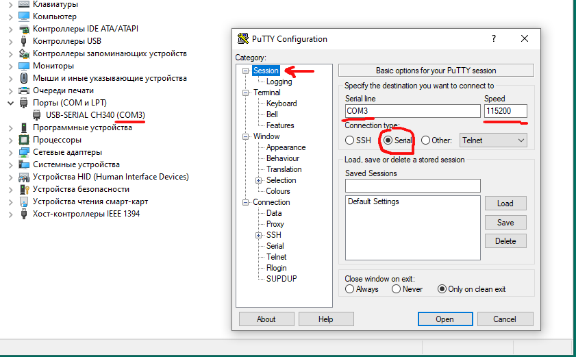
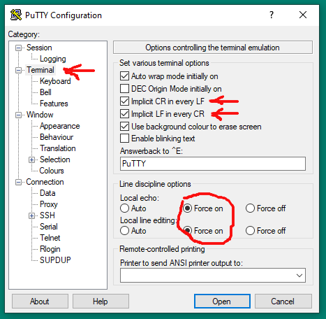
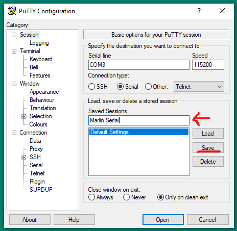
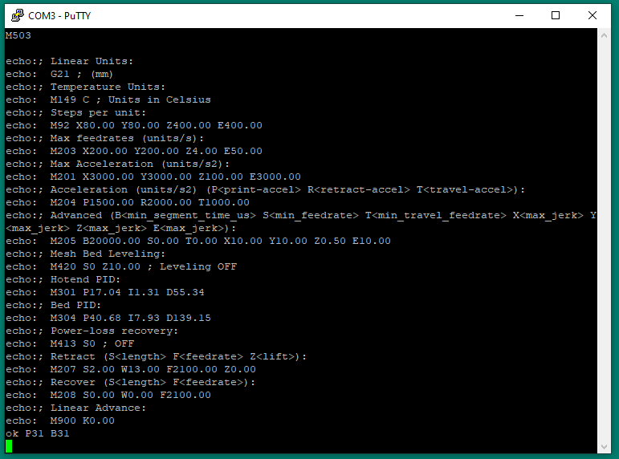

# Отправка GCODE при помощи putty.

### Зачем Putty?

Существует большое количество терминальных программ. В области 3D печати некоторые даже используют комбайны типа Repiter Host для этой простой задачи. 

Приемущества Putty:

* Не нужно ничего устанавливать. Один исполняемы файл размером 1.3 Мб.
* Позволяет подключаться через COM порт, через SSH, через Telnet
* Простая, быстрая, удобная

Скачать можно [тут](https://www.chiark.greenend.org.uk/~sgtatham/putty/latest.html), в разделе Alternative binary files. В данном случае, нет никакой разницы x32 или x64, можно использовать x32 как универсальный вариант.

### Подключение по USB

На платах от MKS USB реализован через USB-UART преобразователь CH340. Чаще всего, драйвер для него уже есть в системе. У пользователей windows иногда возникают с этим проблемы. Если устройство не определяется, драйвер нужно установить отдельно ([установка драйвера](http://wiki.amperka.ru/articles:driver-ch340)).

Чтобы определить, как определилось устройство и какой номер COM порта был назначен, нужно отрыть диспетчер устройств. Сочетанием кнопок Win+R открывается окно "Выполнить...", нужно ввести devmgmt.msc и нажать Enter.

В открывшемся окне в разделе "Порты (COM и LPT)" должно быть устройство "USB-SERIAL CH340" и номер COM порта для него.

### Настройка PUTTY

В основном окне программы, на закладке Session нужно выбрать "Connection type" в Serial. В поле Serial Line указать нужный номер COM порта (из диспетчера устройств). В поле Speed установить 115200.

На закладке "Terminal" нужно включить "Implict CR in every LF" и "Implict LF in every CR". В разделе Line discipline options установить "Local echo" и "Local line editing" в Force on.

Теперь на закладке "Settings" в поле "Saved Sessions" можно ввести название для текущего набора настроек и нажать "Save". Сохраненный профиль настроек появится в окне ниже. Для подключения достаточно дважды кликнуть на нужный профиль.

Откроется окно терминала в которое можно писать команды и видеть ответ на них. Для примера можно попробовать M105 (вернет показания температуры) или M503 вернет сохраненные настройки. Команды вводятся в английской раскладке, отправляются нажанием Enter.
Если ответ на команду нужно скопировать, его достаточно выделить в терминале, он будет автоматически скопиован в буфер обмена.

