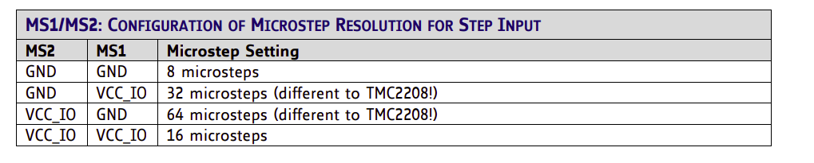
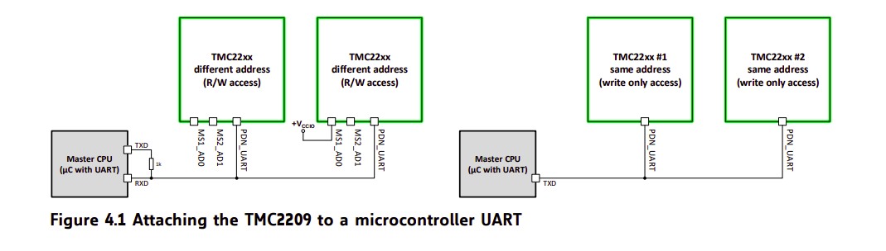
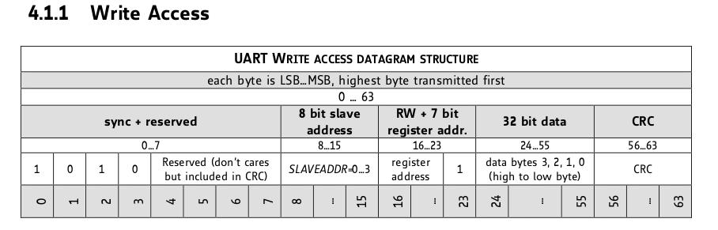
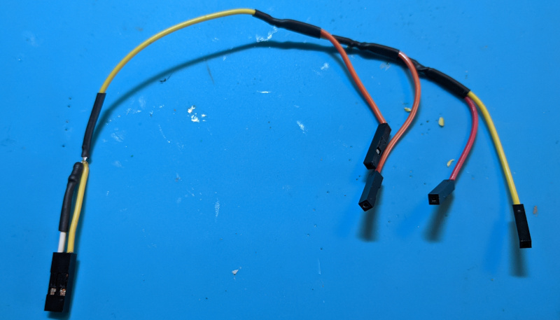
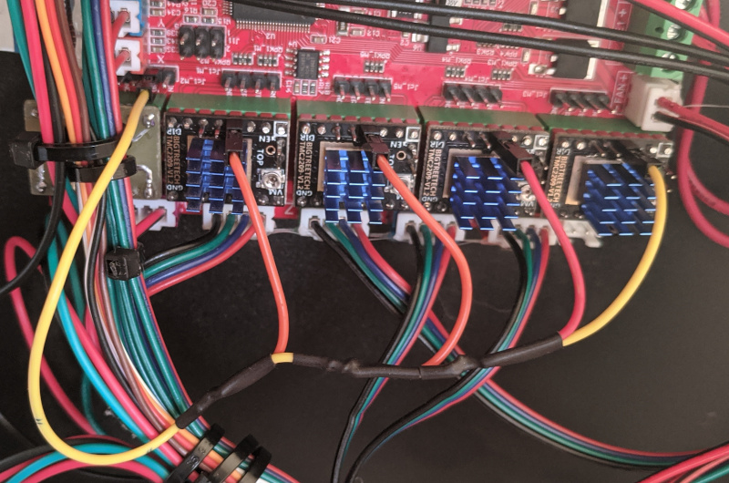
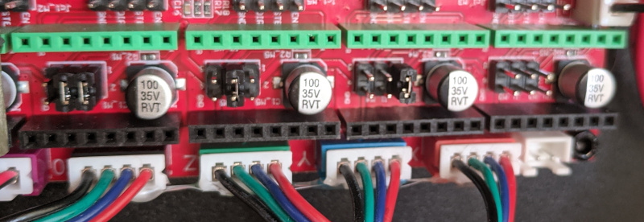

# Настройка драйверов TMC 2209, подключение по UART к robin nano

Datasheet на микросхему драйвера:

* [TMC 2209](https://www.trinamic.com/fileadmin/assets/Products/ICs_Documents/TMC2209_Datasheet_V105.pdf)
* [TMC 2208](https://www.trinamic.com/fileadmin/assets/Products/ICs_Documents/TMC220x_TMC2224_Datasheet_Rev1.10.pdf)

Описание модулей драйверов от BIGTREETECH:

* [Manual](https://github.com/bigtreetech/BIGTREETECH-TMC2209-V1.2/blob/master/manual/TMC2209-V1.2-manual.pdf)

Видео о работе шаговых двигателей:

* [Принцип работы шагового двигателя](https://www.youtube.com/watch?v=r_V8vIuEPws)

Драйвер TMC 2209 может работать в простом режиме, называемом stanalone, когда управление драйвером осуществляется только сигналами STEP и DIR, или в режиме с управлением по UART.

Есть две важных настройки драйвера: деление шагов и ток на моторы.

## Деление шагов

Этот параметр задает, сколько "шагов" сделает шаговый двигатель, на один импульс по линии STEP. Эти настройки задаются либо программно, если подключен интерфейс UART, либо в ручную установкой перемычек MS1 и MS2. В случае ручной установки, шаги задаются так:



На плате robin nano, эти перемычки находятся под драйвером. В данном случае, можно считать, что GND в таблице это снятая перемычка, а VCC_IO это установленная.

Значение по-умолчанию - 16 микрошагов. Т.е. для того, чтобы сделать 1 полный шаг шагового двигателя, нужно отправить 16 импульсов по линии STEP. Или, иначе говоря, если отправить 1 импульс по линии STEP, шаговый двигатель повернется на 1/16 шага. Учитывая количество шагов двигателя на 1 оборот и передаточное отношение привода, для FB4S, например, получается, что при делении шага 1/16, для перемещения по оси X на 1 мм нужно сделать 80 импульсов. Или, иначе говоря, на 1 импульс перемещение по оси X составит 0,0125мм.

Если увеличить значение делителя шагов, например до 64, то для перемещения на 1мм по оси X понадобится уже 320 импульсов по линии STEP. Таким образом, на один импульс, перемещение по оси X составит 0,003125 мм.

## Ток двигателей

В ручном режиме максимальный ток, который будет выдавать драйвер на шаговый двигатель, устанавливается вращением переменного резистора на драйвере. Контролируется напряжение на выводе Vref. Формула для расчета:


Следует учитывать, что в формуле значение тока стоит RMS.

На практике, рекомендуемое значение Vref=1.2V соответствует току в 900мА (для драйверов от BIGTREETECH).

## Управление драйвером по UART

Настраивать режим работы драйвера можно не только перемычками MS1 и MS2 и переменным резистором, но и программно. Драйвер использует однопроводную шину UART. Более того, на одну шину можно подключить до 4 драйверов одновременно. Схема из datasheet на драйвер:



В схеме показаны два варианта подключения: полноценный (read/write) слева и режим только записи справа (write only).

Для того, чтобы обращаться на одной линии к конкретному драйверу, существует возможность задать драйверу адрес.



Устанавливается адрес перемычками MS1 и MS2. Двумя битами можно выставить 4 разных комбинации, что соотвествует максимальному количеству драйверов на одной линии.

При управлении драйвером по UART есть возможность задавать ток двигателя и устанавливать делитель шагов. Делитель шагов, при установке программно, имеет следующие возможные значения: 1/1, 1/2, 1/4, 1/8, 1/16, 1/32, 1/64, 1/128, 1/256 (биты 24-27 регистра 0x6C).

## Практическая реализация на плате robin nano

На плате robin nano не разведены дорожки для подключения драйверов по UART, поэтому подключить драйвера можно только проводами. На драйверах от BIGTREETECH ноги UART сделаны удлиненными, поэтому к ним можно подключиться при помощи обычных dupont проводов. Положение ноги UART на драйвере зависит от запаянной перемычки PDN и в состоянии по-умолчанию находится на 4-той ноге драйвера. Подробнее в [руководстве на драйвер](https://github.com/bigtreetech/BIGTREETECH-TMC2209-V1.2/blob/master/manual/TMC2209-V1.2-manual.pdf)

На плате для управления драйверами можно использовать свободные ноги управления вторым экструдером. Перед разъемом для драйвера находится стандартный штырьковый разъем с линиями En, Step, Dir.

Для подключения драйверов используются ноги Step и Dir. Я пробовал подключать к одной ноге, без резистора на линию TX и все так же работало. В итоговом варианте, я сделал схему как рекомендует производитель драйвера - напрямую в RX и через резистор в TX. Провод для подключения (на белом проводе внутри термоусадки резистор на 1K):



Подключение на одну ногу:



В обоих случаях, при подключении только на ногу STEP и при подключении к STEP и DIR, драйвера работают в режиме read-write, управляется каждый драйвер индивидуально.

Для переключения драйверов в режим UART нужно снять перемычку MS3. Это довольно важный момент. Питание драйверов осуществляется от 5V, поэтому при установленной перемычке MS3, нога UART драйвера замкнута на линию 5V. Если подключить ногу UART драйвера к линии STEP и не убрать перемычку, на линию STEP попадет 5V, что может вызвать повреждение МК.

Адреса драйверов задаются перемычками MS1 и MS2. В данном случае, нумерация следующая: X - 0, Y - 1, Z - 2, E - 3.



## Настройка Marlin

В Marlin есть полная поддержка драйверов TMC 2209, включая задание адреса.

Установка типа драйвера (Marlin/Configuration.h):

```
#define X_DRIVER_TYPE  TMC2209
#define Y_DRIVER_TYPE  TMC2209
#define Z_DRIVER_TYPE  TMC2209
#define E0_DRIVER_TYPE TMC2209
```

Для работы по UART нужно задать ноги в Marlin/src/pins/stm32f1/pins_MKS_ROBIN_NANO.h:
```
#if HAS_TMC220x
  /**
   * TMC2208/TMC2209 stepper drivers
   */
  //
  // Software serial
  //
  #define X_SERIAL_TX_PIN                   PA6
  #define X_SERIAL_RX_PIN                   PA1

  #define Y_SERIAL_TX_PIN                   PA6
  #define Y_SERIAL_RX_PIN                   PA1

  #define Z_SERIAL_TX_PIN                   PA6
  #define Z_SERIAL_RX_PIN                   PA1

  #define E0_SERIAL_TX_PIN                  PA6
  #define E0_SERIAL_RX_PIN                  PA1

  // Reduce baud rate to improve software serial reliability
  #define TMC_BAUD_RATE 19200
#endif
```

В данном случае, используются две ноги, как рекомендовано в datasheet. Если используется только одна нога, RX и TX pin нужно поставить одинаковыми.

Настройки адресов драйверов (Marlin/Configuration_adv.h):
```
/**
   * Four TMC2209 drivers can use the same HW/SW serial port with hardware configured addresses.
   * Set the address using jumpers on pins MS1 and MS2.
   * Address | MS1  | MS2
   *       0 | LOW  | LOW
   *       1 | HIGH | LOW
   *       2 | LOW  | HIGH
   *       3 | HIGH | HIGH
   *
   * Set *_SERIAL_TX_PIN and *_SERIAL_RX_PIN to match for all drivers
   * on the same serial port, either here or in your board's pins file.
   */
  #define  X_SLAVE_ADDRESS 0
  #define  Y_SLAVE_ADDRESS 1
  #define  Z_SLAVE_ADDRESS 2
  #define E0_SLAVE_ADDRESS 3
```

Установка тока и делителя шагов (Marlin/Configuration_adv.h):
```
#if AXIS_IS_TMC(X)
    #define X_CURRENT       800        // (mA) RMS current. Multiply by 1.414 for peak current.
    #define X_CURRENT_HOME  X_CURRENT  // (mA) RMS current for sensorless homing
    #define X_MICROSTEPS     32    // 0..256
    #define X_RSENSE          0.11
    #define X_CHAIN_POS      -1    // <=0 : Not chained. 1 : MCU MOSI connected. 2 : Next in chain, ...
  #endif

  #if AXIS_IS_TMC(Z)
    #define Z_CURRENT       800
    #define Z_CURRENT_HOME  Z_CURRENT
    #define Z_MICROSTEPS     32
    #define Z_RSENSE          0.11
    #define Z_CHAIN_POS      -1
  #endif

  #if AXIS_IS_TMC(E0)
    #define E0_CURRENT      800
    #define E0_MICROSTEPS    32
    #define E0_RSENSE         0.11
    #define E0_CHAIN_POS     -1
  #endif
```

В данном случае для всех драйверов установлен ток в 800мА и деление 1/32.

Установка шагов для делителя 1/32 (Marlin/Configuration.h)
```
/**
 * Default Axis Steps Per Unit (steps/mm)
 * Override with M92
 *                                      X, Y, Z, E0 [, E1[, E2...]]
 */
#define DEFAULT_AXIS_STEPS_PER_UNIT   { 160, 160, 800, 800 }
```

Режим работы драйвера (Marlin/Configuration_adv.h):
```
/**
   * TMC2130, TMC2160, TMC2208, TMC2209, TMC5130 and TMC5160 only
   * Use Trinamic's ultra quiet stepping mode.
   * When disabled, Marlin will use spreadCycle stepping mode.
   */
  #define STEALTHCHOP_XY
  #define STEALTHCHOP_Z
  #define STEALTHCHOP_E
```

Для контроля за драйверами нужно включить (Marlin/Configuration_adv.h):
```
 /**
   * Monitor Trinamic drivers
   * for error conditions like overtemperature and short to ground.
   * To manage over-temp Marlin can decrease the driver current until the error condition clears.
   * Other detected conditions can be used to stop the current print.
   * Relevant G-codes:
   * M906 - Set or get motor current in milliamps using axis codes X, Y, Z, E. Report values if no axis codes given.
   * M911 - Report stepper driver overtemperature pre-warn condition.
   * M912 - Clear stepper driver overtemperature pre-warn condition flag.
   * M122 - Report driver parameters (Requires TMC_DEBUG)
   */
  #define MONITOR_DRIVER_STATUS
```

```
#define TMC_DEBUG
```

На этом настойка закончена. После прошивки важно сначала сделать Initialize eeprom.

Посмотреть состояние драйверов можно командой [M122 S0](https://marlinfw.org/docs/gcode/M122.html). Если в выводе команды значение Driver registers не 00:00:00:00 или FF:FF:FF:FF, то связь с драйвером установлена.

## Драйвера TMC 2208

У драйвера TMC2208 отсутствует возможность задать адрес. Поэтому для подключения этих драйверов не получится использовать всего 1 ногу. Их можно подключить используя как минимум 4 ноги. Если к плате не подключено никакого дополнительного оборудования, то можно использовать 3 свободных ноги второго экструдера (En, Step, Dir) и ногу PB2.
